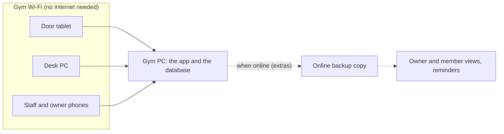

# Jeyo's Hardhit Gym Management System

A web app for Jeyo's Hardhit Fitness Center that replaces its logbooks, wall list, and hand-counted stock. It runs on the gym's own PC, so check-ins, payments, and sales keep working when the internet is down.

> **Status (September 16, 2026): the code workspace and pull request checks (U1) are in place, but no gym features exist yet.**
> The next step is **U2**, the server foundation.
> Everything below describes what the plan says the system *will* do.

## The problem

- Finding a member means flipping through logbook pages, and expiry dates live on a wall list.
- Protein powder, creatine, and energy drinks are counted by hand, and every sale is written down.
- Members skip signing in, and some non-members train and leave without paying.
- The owner has no current view of who has paid, who trained today, or what sold.
- The gym's internet drops, and check-in has to keep working when it does.

## What it will do

**Core** (built and tested first)

- Members on owner-defined plans (Monthly, Student Monthly, 3-Month, and so on), with color-coded status: active, expiring soon, or expired.
- QR check-in at a door tablet. Each member code works once per day, the screen shows the member's photo, and staff can override at the desk.
- Walk-ins pay first and get a one-day QR pass.
- Product and shake sales with stock counts, low-stock warnings, and add-ons such as banana or egg.
- Cash, GCash, and Maya payments, with e-wallet reference numbers.
- A daily report for closing out the cash drawer and GCash/Maya history.
- Owner corrections, a printed member list and paper log for power outages, and separate owner and staff accounts.

**Extras** (built after the core in this order; cut from the end if the semester runs short)

1. Owner insights, offline: members at risk of not renewing, and when stock will run out.
2. Automatic cloud backup.
3. The owner's view of the business from home.
4. Member logins through the online service.
5. Expiry reminders by SMS or email.

## How it will work



The gym PC holds the only live copy of the data. Devices at the gym reach it over local HTTPS. The online extras only read a filtered copy.

## Tech stack (planned)

| Part | Choice |
|---|---|
| Language | TypeScript |
| Server | Node.js 24 LTS, Express 5 |
| Screens | React 19, Vite |
| Database | SQLite (`better-sqlite3`) with Drizzle ORM |
| Tests | Vitest, Supertest, React Testing Library, Playwright |
| Runs as | A Windows service on the gym PC (NSSM) |
| Online extras | Litestream backup to a private bucket, plus a small hosted read-only service |

## Progress

- [x] Concept paper and client discussion
- [x] Requirements: 62 requirements, 7 key flows, 16 acceptance examples
- [x] Implementation plan: 22 units, reviewed
- [x] Shared repository and team Git workflow
- [ ] Phase 1: Foundation (U1 to U3, plus certificates and door tablet setup from U14). U1 is done.
- [ ] Phase 2: Thin working path, from registering a member to a door scan showing on the desk (U4, U5, U6, U22)
- [ ] Phase 3: Parallel tracks, one teammate each: members (U7, U8), check-in (U9), sales (U10)
- [ ] Phase 4: Daily report, outage support, corrections, releases (U11 to U13, U20, rest of U14)
- [ ] Phase 5: Go-live at the gym (U21)
- [ ] Phase 6: Extras (U15 to U19)

**Still to confirm with the client**

- What the daily report must show (R28).
- Whether reminders go by SMS or email, and how many days before expiry (R38).
- How members carried over from the logbook give consent for their data (R8, R44).
- The month-end renewal rule: a January 31 expiry renews to February 28, then back to March 31 (R55).
- Whether the gym has a printer for the closing-time member list (R45).

**Still to confirm with the instructor**

- Whether rule-based owner insights count as the course's AI feature.

## Repository layout

```text
README.md            this file
CONTRIBUTING.md      how the team branches, commits, and merges
CLAUDE.md            project rules and commands for Claude sessions
docs/plans/          the requirements and implementation plan
.github/             pull request template and the CI workflow
packages/shared/     code used by both the browser and the server
packages/domain/     database tables and business rules
packages/server/     the app that runs on the gym PC
packages/client/     the React screens (desk, door, owner)
packages/online/     the hosted read-only service for the extras
e2e/                 end-to-end browser tests (Playwright)
```

Config files at the root set up TypeScript (`tsconfig.base.json`), ESLint (`eslint.config.js`), Prettier (`.prettierrc`), Vitest (`vitest.config.ts`), and Playwright (`playwright.config.ts`). U14 adds `ops/`, the install, device setup, update, backup, and handover guides.

## Reading the plan

The plan is [docs/plans/2026-09-15-0946-feat-jeyos-gym-management-system-plan.md](docs/plans/2026-09-15-0946-feat-jeyos-gym-management-system-plan.md). It uses these IDs:

| ID | Meaning | Example |
|---|---|---|
| R | A requirement: what the system must do | R15: a member code works once per day |
| F | A key flow | F2: a walk-in visit |
| AE | An acceptance example with exact dates or numbers | AE3: renewal dating |
| KTD | A key technical decision | KTD4: how the door tablet scans codes |
| U | An implementation unit, about one pull request | U7: plans, renewals, and expiry dating |

## Getting started

Install these once:

- [Node.js 24 LTS](https://nodejs.org/)
- [Git](https://git-scm.com/)
- [GitHub CLI](https://cli.github.com/), then run `gh auth login`

Clone the repo and open the folder:

```bash
git clone https://github.com/zealot-SEAlot/gym-mana-JEYO-ment.git
```

```bash
cd gym-mana-JEYO-ment
```

Install the exact dependency versions from `package-lock.json`:

```bash
npm ci
```

Download the Chromium browser that the Playwright tests use. It goes into your user folder, once per computer:

```bash
npx playwright install chromium
```

If you use VS Code, install the recommended extensions when it offers them, and allow it to use the workspace TypeScript version.

### Commands

| Command | What it does |
|---|---|
| `npm run typecheck` | Checks the types in every package and in `e2e/` |
| `npm run lint` | Checks code rules with ESLint; a single warning fails |
| `npm run format` | Formats the code with Prettier |
| `npm run format:check` | Only checks the formatting |
| `npm test` | Runs the unit and component tests |
| `npm run test:coverage` | Runs the tests and fails if coverage drops below 80% |
| `npm run test:e2e` | Builds the screens and tests them in a real browser |
| `npm run build` | Builds the screens into `packages/client/dist` |
| `npm run dev --workspace @jeyos/client` | Opens the screens with live reload (a placeholder page for now) |
| `npm run dev --workspace @jeyos/server` | Runs the server and restarts it on save (a placeholder for now) |

Every pull request runs the same checks on GitHub on Windows, plus a dependency audit, a secret scan, and a check that no photos or other binary files were added. Run `npm run typecheck`, `npm run lint`, and `npm test` before asking for review.

## Contributing

Only the three team members commit, push, and merge. See [CONTRIBUTING.md](CONTRIBUTING.md) for the step-by-step workflow.

## Team

- Nathan Florance Casas
- Lee Angelo D. Amatiaga
- Demosthenes A. Maglasang III

## Privacy

The system will store members' names, contact details, and photos under the Philippine Data Privacy Act of 2012 (Republic Act No. 10173). Never commit real member data, database files, photos, certificates, or keys to this repository.

## License

No license has been chosen yet.
