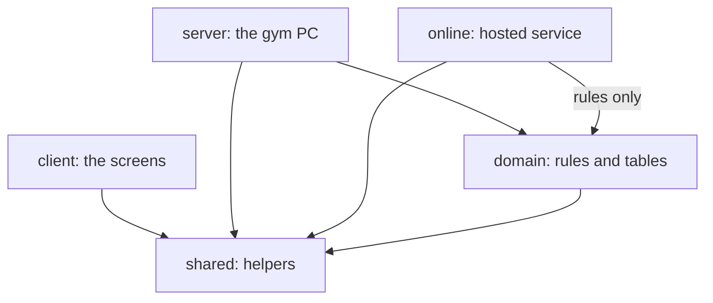

# U1: Setting up the project

**In one sentence:** U1 built no gym features. It set up the empty project so every part of the system lives in one place, and so every change is checked automatically before it joins the main copy.

Think of U1 as preparing the gym building before any equipment arrives: the rooms, the doors between them, and the checklist staff run before opening. The only thing you can see is a placeholder page that shows the gym's name.

## Words used on this page

| Word | Meaning | Gym example |
|---|---|---|
| Code | Written instructions a computer follows | "A member may enter once a day," written so a computer can check it |
| Repository (repo) | The one shared folder on GitHub that holds all of the project's files and their full history | Ours is `zealot-SEAlot/gym-mana-JEYO-ment` |
| Package | One part of the system, kept in its own folder inside the repo | `client` is the package for the screens |
| Import | When code in one package uses code from another | The screens use the gym's name from `shared` |
| Server | A program that waits for requests and answers them | The program on the gym PC that decides whether a member may enter |
| Browser | The app that shows web pages, such as Chrome | The door tablet shows the scan page in a browser |
| Database | The file where the system stores its records | Every member, payment, and check-in |
| Dependency | Code written by other people that our project uses | React, which draws the screens |
| Branch | A separate line of work in the repo, so changes don't touch the main copy (`main`) until they are ready | `feat/u1-workspace-scaffold`, where U1 was built |
| Pull request | A request to join a branch's changes into `main`, which a teammate reviews first | "Add the daily report" |
| Merge | Joining a pull request's changes into `main` | Clicking "Merge" after review |
| Check | A program that tests a pull request automatically and shows a green tick or a red cross | "CI" on every pull request |
| Test | A small program that runs our code and confirms it gives the right answer | "₱800 plus ₱200 shows as ₱1,000" |

## What U1 built

- **Five packages**, each with one job, and rules about which may use which.
- **One command for each kind of check**, which works the same way on every teammate's laptop.
- **An automatic check on every pull request**, which runs all of those commands on a Windows computer at GitHub.
- **Safety nets** that keep gym data, such as the database and member photos, out of the public repo.
- **One placeholder test per package.** Each one proves the test tools work. They don't test gym features yet, because there are none.

## The five packages

The plan sets out the five packages in KTD16, one of its Key Technical Decisions. In U1 each package holds only a placeholder. This table describes what each one will hold.

| Package | What it holds | Where it runs | May use |
|---|---|---|---|
| `shared` | Small helpers every part needs: money, the Manila date, role names, and the rules for what each request must contain | Everywhere | No other package |
| `domain` | The gym's business rules and the layout of the database tables | Inside `server` and `online` | `shared` |
| `server` | The program on the gym PC that stores records and makes every decision | The gym PC | `shared` and `domain` |
| `client` | The screens: the front desk, the owner pages, and the door scan page | The browser on each device | `shared` only |
| `online` | The small hosted service for the extras, such as the owner checking numbers from home | A server on the internet | `shared`, and `domain`'s rules but not its tables |

An arrow means "may use code from." There is no arrow from `client` to `domain`. That gap is on purpose, and a section below explains why.

## Why one repo with five packages instead of five repos

**The short answer:** the five packages use each other's code all the time. Keeping them together means one change is made, reviewed, and checked in one place.

The plan chose one repo (KTD1) but did not write down why. These are the reasons that apply to us:

- **One change, one pull request.** Say the owner wants an emergency contact number for each member. The rule for what the form must contain goes in `shared`, the new column in the members table goes in `domain`, saving it goes in `server`, and the form field goes in `client`. In one repo, that is one pull request a teammate reviews as a whole. With separate repos, it becomes four pull requests that must be merged in the right order, or the system breaks in between.
- **One copy of each helper.** The money code lives only in `shared`, so the screens and the server use the same copy. They can never disagree about how an amount is written.
- **No publishing step.** Inside one repo, npm (the tool that installs dependencies) links the packages together on each laptop. When `server` asks for `@jeyos/shared`, npm points it straight at the `packages/shared` folder. With separate repos, `shared` would have to be published like an outside library, with a new version number, after every edit.
- **One set of checks.** U1's goal is one command that checks every package, on every laptop and every pull request. Separate repos would each need their own copy of that setup, and the copies could drift apart.

Separate repos make sense when separate teams own the parts and release them on their own schedules. We are three people shipping one system to one gym.

## Why the screens (`client`) may not use `domain`

**The short answer:** code that runs in a browser can be changed by whoever holds the device. So the decisions stay on the gym PC. The screens ask the server, and the server decides.

`client` holds the screens. Its code is sent to each device and runs inside that device's browser: the front desk PC, the door tablet, and the owner's phone. `domain` holds the business rules, such as "is this membership still active?", and the layout of the database.

1. **A browser is not a safe place for decisions.** Browsers have developer tools that let a person see and change the code running on a page. If the door tablet decided by itself whether a membership was active, someone could change it to always say yes. So the server makes the decision, and the screen shows the answer. The plan says the same about permissions: hiding a button on the screen does not stop anyone from doing that action (KTD6).
2. **A browser can't open the database.** The database file will live on the gym PC, and only the server will read it. The table layouts in `domain` are of no use in a browser.
3. **One referee.** If the screens kept their own copy of the rules, the front desk could say "active" while the door says "expired." With the rules in one place, a rule change is made once.

**The gym version:** the rulebook stays in the back office with the manager (the server). The front desk (the client) calls the manager to ask, "Can this member come in?" If the rulebook sat on the counter, anyone could write in it.

This is why `shared` exists. The plan calls it the browser-safe code (KTD16): the small set of helpers that are safe to run in both places. `shared` is also set up without anything that exists in only one place, such as the browser's window or the server's process details, so its code works in both.

### What stops it

A tool called ESLint reads our code and enforces the "May use" column above. If a file in `client` imports `@jeyos/domain`, ESLint fails with a message naming the plan's rule, and the pull request check turns red. U1 tested this on purpose: a screen was made to import `domain`, and the check failed as expected.

One part of the rule comes later. `online` may use `domain`'s rules but not its tables. That ban needs the tables to exist first, so it arrives with U2.

## The checks that run on every pull request

Every pull request runs the same checklist at GitHub, like the list staff run through before opening the gym. If any item fails, the pull request shows a red cross, and it should not be merged until it is fixed.

| Command | What it does | What it catches, for example |
|---|---|---|
| `npm ci` | Installs every dependency at the exact version the project lists | A laptop quietly using a newer library than everyone else |
| `npm run typecheck` | TypeScript checks that each value is used as the right kind of thing | Treating a member's name as an amount of money |
| `npm run lint` | ESLint checks our code rules; even one warning fails | `client` importing `domain`; a missing `await` (a step that doesn't wait for the one before it to finish); showing text as raw web page code, which could let a scanned code run as a program |
| `npm run format:check` | Prettier checks that spacing and layout are consistent | Messy spacing that makes a review harder to read |
| `npm run test:coverage` | Vitest runs every test and measures how much of the code they run; fails below 80% | A wrong answer, or new code that no test runs |
| `npm run build` | Packs the screens into files a browser can load | Screens that can't be packed for the gym's devices |
| `npm run test:e2e` | Playwright opens the built page in a real browser (Chromium, the base of Chrome) | A page that passes the other tests but doesn't show correctly in a browser |
| `npm audit` | Looks up our dependencies in a public list of known security problems; fails on moderate or worse | A library with a published security hole |

A second part of the check protects the repo itself:

- **Secret scan (gitleaks):** fails if a pull request contains something that looks like a password or key.
- **Binary file check:** fails if a pull request adds a file that isn't plain text, such as a photo or a database, anywhere except `e2e/fixtures/` (the folder for test samples).

The check itself can only read the repo. It can't push code, write comments, or change settings.

### Why the check runs on Windows

The gym PC runs Windows, so the checks do too. A problem that appears only on Windows then shows up in the pull request, not at the gym.

### Why `npm ci` and not `npm install`

`package-lock.json` is the list of the exact version of every dependency. `npm install` may pick newer versions and rewrite that list. `npm ci` installs exactly what the list says, never changes it, and stops with an error if the list and `package.json` disagree.

`.npmrc` also sets `save-exact`, so a newly added dependency is recorded at one exact version, not "this version or newer." And `.nvmrc` names Node 24 as the version everyone runs. Together, every laptop and the check run the same code.

### What 80% coverage means, and what it doesn't prove

Coverage measures how much of our code runs while the tests run. The check fails if less than 80% of the code runs.

It catches code that no test touches at all. It does **not** prove the answers are right, because a test can run a line of code without checking what that line produced. Only a test that compares the result with the correct answer, such as "₱800 plus ₱200 shows as ₱1,000," proves the result.

Two files are left out of the count: `packages/server/src/index.ts` and `packages/client/src/main.tsx`. They only start the program, and the end-to-end test in U22 covers them. The team keeps this list to starting files only, because leaving out other files would make 80% easier to reach without more testing.

### Why the browser test uses the built page

Playwright tests the page after it is built, the way the gym PC will serve it, not the quicker version used while developing. For now it checks one thing: the page heading reads "Jeyo's Hardhit Fitness Center." U22 adds the real door-scan test.

## Two rules about TypeScript

TypeScript is JavaScript with labels, called types, that say what kind of thing each value is: text, a number, a member, and so on. The labels let the computer catch mistakes before the code runs.

### We use TypeScript 6.0.3, not the newer 7

ESLint reads TypeScript through a helper called typescript-eslint. Its version 8.70.0 supports only TypeScript below 6.1. Vite and Vitest, our other tools, don't depend on TypeScript, so this one helper is the only thing holding us back. We move to TypeScript 7 once typescript-eslint supports it.

### The server runs TypeScript without a build step

Node 24, the program that runs our server, can run `.ts` files directly: it deletes the type labels and runs what is left. That means no extra build step and no extra package. It also means we may use only TypeScript features that disappear cleanly when the labels are deleted. `tsconfig.base.json` enforces three rules:

- **No `enum` or `namespace`.** These produce real code, not only labels, so deleting them would break the program. Write the allowed values as a plain list of text instead, for example `"active" | "expired"`.
- **`import type` for imports used only as labels**, so deleting them leaves working code.
- **`.ts` at the end of file names in imports**, such as `import { GYM_NAME } from "./index.ts"`, because Node needs the real file name.

## Keeping gym data off the internet

The repo is public: anyone on the internet can read every file in it and every past version. The gym's records must never go there. U1 set up three layers:

1. **`.gitignore`** tells Git to skip certain files entirely: database files; the `data`, `photos`, `uploads`, and `backups` folders; certificates and keys; and `.env` files, which hold passwords.
2. **The secret scan** fails a pull request that contains something that looks like a password or key.
3. **The binary file check** fails a pull request that adds a photo, database, or other non-text file outside `e2e/fixtures/`.

The first layer prevents the mistake. The other two are the backup alarm if something slips past it. Know their limit: the checks run after a branch is pushed to GitHub, so a file they catch is already online. They stop it from being merged, not from being seen.

### Why each GitHub action is named by a long commit ID

The check uses small programs written by others, called actions, such as `actions/checkout`. Our check names each one by a long commit ID, such as `3d3c42e5…`, not by a short version tag, such as `v7`. An action's publisher can move a tag to point at different code later. A commit ID always means the same code. So if an action's account were taken over and its tag moved to harmful code, our check would still run the code we reviewed.

## What U1 left for later

- **A check that the database layout matches its migration files** (the step-by-step changes that build the database) comes with U2a. A comment in `ci.yml` marks the spot.
- **The ban on `online` using `domain`'s tables** comes with U2, once the tables exist.

## Where to find it in the code

| File | What it holds |
|---|---|
| [`package.json`](../../package.json) | The list of packages and the commands |
| [`.nvmrc`](../../.nvmrc) and [`.npmrc`](../../.npmrc) | The Node version, and the exact-version setting |
| [`tsconfig.base.json`](../../tsconfig.base.json) | The TypeScript rules every package follows |
| [`eslint.config.js`](../../eslint.config.js) | The code rules, including which package may use which |
| [`vitest.config.ts`](../../vitest.config.ts) | Test settings and the 80% coverage floor |
| [`playwright.config.ts`](../../playwright.config.ts) | Browser test settings |
| [`.github/workflows/ci.yml`](../../.github/workflows/ci.yml) | The check that runs on every pull request |
| [`.gitignore`](../../.gitignore) | The files Git must skip |
| [The plan, U1 and KTD16](../plans/2026-09-15-0946-feat-jeyos-gym-management-system-plan.md) | The original decisions |

## Check yourself

Answer each question out loud or on paper before you read the answers. If you can answer all of them, you can explain U1 to the instructor.

1. The owner wants an emergency contact number for each member. Which packages would change, and why is that easier with one repo?
2. A teammate makes the door scan page ask `domain` directly whether a membership is active. What happens when they open the pull request, and why is that the right result?
3. Why does the pull request check run `npm ci` and not `npm install`?
4. The tests pass and coverage is 92%. Does that prove the daily report adds up money correctly?
5. Every check passes on a teammate's Mac. Why does the pull request check still run on Windows?
6. A teammate wants to write member statuses as an `enum`. What goes wrong, and what should they write instead?
7. Why does the project use TypeScript 6.0.3 instead of 7?
8. Why does `ci.yml` name each action by a long commit ID instead of a tag like `v7`?
9. A member photo ends up in a folder called `pictures`, and someone includes it in a pull request. What stops it, and is the photo safe?

### Answers

1. Four packages: `shared` (the rule for what the member form must contain), `domain` (the new column in the members table), `server` (saving it), and `client` (the field on the screen). In one repo this is one pull request, reviewed and checked as a whole. If you said only `client`: the screen only collects the value. The rules, the table, and the saving all live in other packages.
2. `npm run lint` fails with a message naming the plan's rule (KTD16), so the pull request check turns red. That's right because code in the browser can be changed by whoever holds the tablet, so the server must decide who may enter. If you said "it works, because it's all our own code": our code arrives on the tablet, but anyone holding the tablet can change it there.
3. `npm ci` installs exactly the versions in `package-lock.json`, never rewrites that file, and stops if the file disagrees with `package.json`. So the check tests the same versions every teammate installs. If you said the two commands do the same thing: `npm install` may pick newer versions and rewrite the list, so two computers can end up running different code.
4. No. Coverage says 92% of the code ran during the tests. It doesn't say the tests checked the answers. Only a test that compares the report's total with the correct amount proves the math. If you said yes, you mixed up "the code ran" with "the code gave the right answer."
5. The gym PC runs Windows, so the check tests on the same kind of computer the system will run on. A problem that happens only on Windows is caught in the pull request instead of at the gym. If you said any computer gives the same result: operating systems differ in details, such as how they write file paths, so passing on a Mac proves less.
6. `npm run typecheck` fails, because `tsconfig.base.json` bans TypeScript features that Node can't delete. Node runs the server by deleting the type labels, and an `enum` produces real code, not only a label. Write the allowed values as a plain list of text instead, such as `"active" | "expired"`. If you said enums are just bad style: the reason is how Node runs our files, not style.
7. ESLint reads TypeScript through typescript-eslint, and its version 8.70.0 supports only TypeScript below 6.1. Our other tools don't depend on TypeScript, so this one helper is the only blocker. If you said TypeScript 7 is broken or unfinished: the reason is our lint helper, not TypeScript 7 itself.
8. An action's publisher can move a tag such as `v7` to point at different code later. A commit ID always means the same code, so the check keeps running exactly what was reviewed. If you said tags never change: they can, and only the commit ID is fixed.
9. `.gitignore` skips the `photos` and `uploads` folders, but not a folder called `pictures`, so Git would include the file. The binary file check then fails the pull request, so the photo won't be merged into `main`. But the check runs after the push, so the photo is already on GitHub, where anyone can see the branch. Tell the team right away so it can be removed. This is why `.gitignore` is the first layer, and why everyone reads `git status` before committing. If you said "the checks keep it off GitHub": they stop a merge, not an upload.
