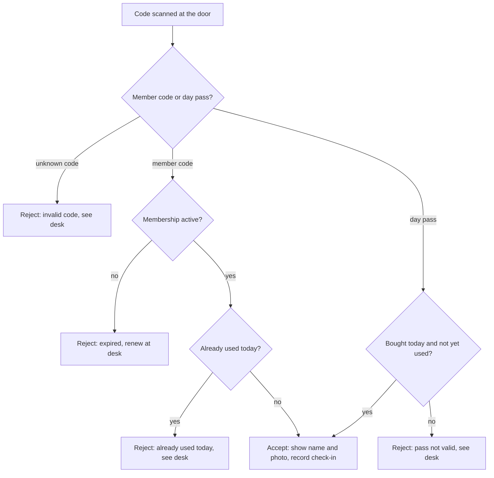
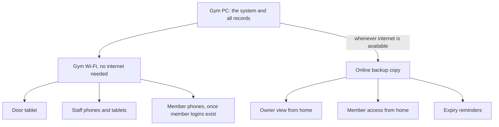

# Jeyo's Hardhit Gym Management System - Plan

## Goal Capsule

- **Objective:** Staff and the owner of Jeyo's Hardhit Fitness Center track memberships, check-ins, walk-in payments, sales, and stock in one system instead of logbooks and a wall list, and the gym keeps checking people in and selling when its internet is down.
- **Product authority:** This Product Contract, built from the team's one-page concept paper ("Initial Project Concept: Jeyo's Gym Management System") and the client discussion it records.
- **Open blockers:** None.

---

## Product Contract

### Summary

A gym management web app that runs on the gym's own PC and works on any phone, tablet, or computer on the gym Wi-Fi without internet.
The core covers members on owner-defined plans with color-coded expiry, QR check-in at a door tablet, walk-in day passes, and product and shake sales with stock counts.
After the core, extras are built in a fixed order and cut from the end if the semester runs short: offline owner insights, cloud backup, the owner's view from home, member logins, and expiry reminders.

### Problem Frame

Jeyo's Hardhit tracks memberships in logbooks, so finding one member means flipping through page after page.
Expiry dates are written on a wall, and keeping that list current is a chore.
Stock of protein powder, creatine, and energy drinks is counted by hand, and every sale is written down, including whether a protein shake had banana, egg, or both.
Members skip signing the logbook when they come in, and some non-members use the gym and leave without paying.
The owner has no current view of who is paid up, who trained today, or what sold.
The gym's internet can drop, and the concept paper requires check-in to keep working when it does.

### Actors

- A1. Owner or manager: sets plans and prices, manages stock and staff accounts, reads reports and insights, and checks the business from home.
- A2. Front-desk staff: registers members, takes payments, sells products and shakes, sells walk-in day passes, and checks people in from the desk.
- A3. Member: shows a QR code at the door and, once member logins exist, views their own code, expiry, and visits.
- A4. Walk-in customer: pays for a single day and enters with a day pass.
- A5. Door tablet: a tablet or spare phone at the entrance that scans codes and shows the result.

Trainers are not actors in this version (see Scope Boundaries).

### Key Decisions

- **The gym PC is the server; devices reach it over the gym Wi-Fi.** Internet is needed only for the online extras. Governs R1, R2, R5. (session-settled: user-directed — chosen over per-device copies that sync later and over an online-first hosted system: avoids conflicting records between devices and dependence on paid hosting.)
- **From-home screens read the online backup copy and show when it was last updated.** Governs R36, R38. (session-settled: user-directed — chosen over a live connection to the gym PC: from-home features keep working at night and during outages, at the cost of data that can lag.)
- **Walk-ins pay before entering and get a one-day QR pass.** Governs R19, R20, R21. (session-settled: user-directed — chosen over logging a visit to be paid before leaving and over a scanner-controlled door lock: needs no hardware purchase, and front-desk staff make sure every walk-in pays.)
- **Codes are scanned by a door tablet, with check-in by name at the desk as the fallback.** Governs R13, R14, R16. (session-settled: user-directed — chosen over a door tablet with no fallback and over staff scanning everyone at the desk: fast at busy times and still handles forgotten codes.)
- **A member code works once per day; the door shows the member's photo and staff can override at the desk.** Governs R14, R15, R16. (session-settled: user-directed — chosen over blocking a code only while the member is inside and over phone codes that change every 30 seconds: cheap to build and matches the rule the client already heard.)
- **Membership plans are time-based and defined by the owner.** Governs R6, R7. (session-settled: user-directed — chosen over a fixed monthly plan plus day pass and over visit-count packs: covers student rates and promos without code changes.)
- **Sealed items carry stock counts; shakes are logged with add-ons but do not deduct ingredients.** Governs R22, R23, R24, R25. (session-settled: user-directed — chosen over recipe-based ingredient deduction and over a sales log with no stock: solves the stock problem without recipe math that drifts when bananas spoil.)
- **Payments are cash or GCash/Maya, with the e-wallet reference number typed in by staff.** Governs R27. (session-settled: user-directed — chosen over cash only and over automatic online payment confirmation: works offline and needs no payment-provider verification or fees.)
- **The AI feature is offline owner insights: renewal-risk alerts and stock run-out predictions.** Governs R29, R30, R31, R32, R33. (session-settled: user-directed — chosen over a face check at the door, which the user dropped, and over logbook-page scanning, an ask-your-gym assistant, and a busy-hours forecast: runs without internet and protects renewal and sales income.)
- **All extras stay planned and are built after the core in a fixed cut order.** Governs R39, R40. (session-settled: user-directed — chosen over a fixed smaller first version of core, insights, backup, and owner remote view: the team wants the full scope, accepting that the demo scope is settled late.)
- **Trainer features wait for a later version.** (session-settled: user-directed — chosen over trainer client lists with paid sessions, a view-only client list, and full coaching tools: keeps the first version on the problems from the client discussion.)
- **Early renewals extend from the old expiry date; late renewals start on the payment date.** Members who renew early lose no days. Governs R11.

### Requirements

**Setup and access**

- R1. The system runs on one computer at the gym, and every in-gym feature works over the gym Wi-Fi with no internet connection.
- R2. Staff and the owner use it from any phone, tablet, or computer on the gym Wi-Fi that has a web browser.
- R3. The owner and each front-desk staff member sign in with their own account.
- R4. Staff can register members, record payments and sales, and check people in, but cannot change prices or plans, delete records, or manage accounts.
- R5. When the gym Wi-Fi fails, staff can still check people in, record payments, and sell directly on the gym PC.
- R41. The owner can correct or void a mistaken sale, payment, or check-in, recording the original values, who made the change, and when, and the correction carries through to stock counts, that day's already-used status, the daily report, and insights.
- R42. The door tablet runs in a scan-only mode, set up and revocable by the owner, that can submit scans and show results but cannot open member records, payments, sales, or staff screens.
- R45. Each night the system prints a list of active members and their expiry dates, which staff use to check members in by name during a power outage.
- R46. After a power outage, staff can enter paper-logged check-ins, payments, and sales with their original times, and each entry is marked as entered after the outage with the staff account that entered it.

**Members and plans**

- R6. The owner creates and edits membership plans, each with a name, price, and length (for example Monthly, Student Monthly, 3-Month, Day Pass).
- R7. Changing a plan's price does not change amounts recorded on past payments.
- R8. Staff register a member with name, contact details, and a photo, recording the member's consent to storing that data on the gym PC, keeping an online backup copy, and receiving expiry reminders; a member who declines a photo can still register.
- R9. Each member gets a unique QR code that staff can print on a card or send to the member as an image, and staff can replace it with a new code that makes the old one invalid at the door.
- R10. The member list marks each member's status with a color: active, expiring soon (7 days or fewer left), or expired.
- R11. A renewal paid on or before the expiry date extends from the old expiry date; a renewal paid after expiry starts on the payment date.
- R12. The desk shows a list of members who are expiring soon.
- R44. The owner can register an existing member with an expiry date carried over from the logbook or wall list, marked as carried over, recording who entered it, and not counted as income in the daily report.

**Check-in**

- R13. A tablet or spare phone mounted at the entrance scans member QR codes and walk-in day passes.
- R14. After each scan, the door screen and the desk screen both show the person's name, their photo when one is on file, and an accept or reject result with the reason.
- R15. A member code is accepted once per calendar day; a second scan that day is rejected with a message that the code was already used today.
- R16. Staff can check an active member in from the desk by name, including a same-day second visit that R15 rejected at the door, while an expired member must renew first.
- R17. An expired member's code is rejected at the door with a message to renew at the desk.
- R18. Every accepted check-in is recorded with its date and time, and a desk check-in also records the staff account that made it.

**Walk-ins**

- R19. A walk-in pays at the desk before using the gym, and the recorded payment produces a one-day QR pass as a printed slip or an image on the customer's phone.
- R20. A day pass is accepted at the door once, only on the day it was bought, and staff can re-admit its holder at the desk later that same day.
- R21. The daily report lists each walk-in's day-pass payment and door entry so staff and the owner can track walk-in payments.

**Sales and stock**

- R22. The owner maintains a product list with prices, and sealed items (for example energy drinks, bottled water, supplement tubs) carry a stock count.
- R23. Selling a sealed item lowers its stock count and warns at a low-stock level the owner sets for that product, and a sale of an item already at zero still goes through with a separate out-of-stock warning.
- R24. Shakes are sold as menu items with optional priced add-ons (for example banana, egg), and each sale records the add-ons chosen.
- R25. Shake sales do not deduct bulk ingredients such as protein powder, bananas, or eggs.
- R26. The owner records restocks, which raise stock counts and build a purchase history.

**Payments and reports**

- R27. Every payment records its method, cash or e-wallet (GCash or Maya), and the staff account that entered it, and an e-wallet payment requires a reference number that is not already on file.
- R28. The daily report shows sales split into cash and e-wallet, membership and day-pass income, product and shake sales, check-in counts, the walk-in payments and entries from R21, members expiring soon, low-stock items, each e-wallet payment with its reference number and the staff account that entered it, each desk check-in with the staff account that made it and any door rejection it overrode, and each record entered after an outage.

**Owner insights (runs offline)**

- R29. Owner insights run on the gym PC without internet.
- R30. Insights flag members at risk of not renewing, based on a drop in how often they visit, so the owner can contact them before they expire.
- R31. Insights predict when each stocked product will run out, based on its recent sales rate.
- R32. Until there is enough check-in and sales history for a prediction, insights say more data is needed instead of showing one.
- R33. A demo mode loads sample history for presenting insights, kept separate from the gym's real records.

**Online extras (need internet)**

- R34. Whenever the gym PC has internet, it copies the gym's data to an online backup automatically, and the owner can restore that backup onto a replacement PC.
- R35. The owner can view today's sales, attendance, stock, and expiring members from any internet-connected device, without editing.
- R36. Every from-home screen reads the online backup copy, shows when that copy was last updated, and keeps working while the gym PC is off or offline.
- R37. Members sign in to see their QR code, expiry date, and visit history, on the gym Wi-Fi and from home, first setting their own password with a one-time code staff give them at the desk.
- R38. Members receive a reminder by SMS or email shortly before their membership expires and again when it has expired, sent from the online copy only after its first update on or after the day the reminder comes due, so a reminder that comes due while the gym PC is off goes out after the PC next connects.
- R43. Only the owner's sign-in and member sign-ins can read the online copy, and a signed-in member, on the gym Wi-Fi or from home, sees only their own code, expiry date, and visits.

**Build order**

- R39. The core (R1 through R28, plus R41, R42, R44, R45, and R46) is finished and tested before any extra starts.
- R40. Extras are built in this order and cut from the end if the semester runs short: owner insights R29 to R33, then cloud backup R34 with the owner half of R43, then owner view from home R35 and R36, then member logins R37 with the member half of R43, then expiry reminders R38.

### Key Flows

- F1. Member check-in at the door
  - **Trigger:** A member arrives with a printed card or a code on their phone.
  - **Actors:** A3, A5, A2
  - **Steps:** The member scans at the door tablet; the screen shows their name, photo, and result; an accepted scan records the check-in; a rejected member goes to the desk, where staff renew an expired membership or check an active member in by name.
  - **Outcome:** Every door scan and desk check-in is recorded without a logbook.
  - **Covered by:** R13, R14, R15, R16, R17, R18
- F2. Walk-in visit
  - **Trigger:** A non-member wants to train for the day.
  - **Actors:** A4, A2, A5
  - **Steps:** The walk-in pays at the desk; staff record the method and any e-wallet reference number; the walk-in receives a day pass and scans it at the door.
  - **Outcome:** The entry and the payment both appear in the daily report.
  - **Covered by:** R19, R20, R21, R27
- F3. Membership renewal
  - **Trigger:** A member appears on the expiring-soon list or is rejected at the door as expired.
  - **Actors:** A3, A2
  - **Steps:** The member pays at the desk; staff record the payment against a plan; the new expiry date is set per R11; the member's status color updates.
  - **Outcome:** The member's next door scan is accepted.
  - **Covered by:** R10, R11, R12, R27
- F4. Selling a shake and a product
  - **Trigger:** A customer orders a protein shake with banana and egg and an energy drink.
  - **Actors:** A2
  - **Steps:** Staff add the shake with its add-ons and the energy drink to the sale, pick the payment method, and record it.
  - **Outcome:** The sale and add-ons are recorded, energy-drink stock drops by one, and a low-stock warning appears if it reaches its low-stock level.
  - **Covered by:** R22, R23, R24, R25, R27
- F5. Owner's end-of-day review
  - **Trigger:** The gym closes for the day.
  - **Actors:** A1
  - **Steps:** The owner opens the daily report, counts the cash drawer against the cash total, matches e-wallet payments against the GCash and Maya transaction history, reviews the day's walk-in payments and entries, and checks low-stock items; once owner insights are built, the owner also reviews at-risk members and predicted stock-outs.
  - **Outcome:** Missing cash, the day's walk-in payments, and low stock are visible the same day.
  - **Covered by:** R21, R27, R28, R30, R31
- F6. Working through a power outage
  - **Trigger:** The power goes out and the gym PC and router are down.
  - **Actors:** A2, A3, A4
  - **Steps:** Staff check arriving members against the latest printed active-member list; staff write each check-in, payment, and sale on paper; when power returns, staff enter the paper records with their original times.
  - **Outcome:** No visit, payment, or sale from the outage is lost, and the daily report flags the late entries for the owner.
  - **Covered by:** R28, R45, R46

### Acceptance Examples

- AE1. **Covers R15, R16, R18.** **Given** a member checked in at 6:00 AM, **when** they scan again at 6:00 PM, **then** the door rejects the code as already used today, and staff at the desk can check them in by name with the check-in recorded under the staff account.
- AE2. **Covers R14, R15.** **Given** a friend scans a screenshot of a member's code at 7:00 AM, **when** the door accepts it, **then** the door and desk screens show the real member's photo so staff can spot the mismatch, and the real member's scan later that day is rejected and sent to the desk.
- AE3. **Covers R11.** **Given** a Monthly membership that expires on September 30, **when** the member renews on September 25, **then** the new expiry is October 30; **when** they instead renew on October 5, **then** the new expiry is November 5.
- AE4. **Covers R10.** **Given** today is September 15, **when** a membership expires on September 22, **then** it shows as expiring soon; **when** it expires on September 23, **then** it shows as active.
- AE5. **Covers R20.** **Given** a day pass bought on September 15, **when** it is scanned a second time that day or scanned on September 16, **then** the door rejects it.
- AE6. **Covers R23.** **Given** an energy drink with 6 in stock and a low-stock level of 5, **when** one is sold, **then** stock shows 5 and a low-stock warning appears.
- AE7. **Covers R8, R14.** **Given** a member who declined a photo at registration, **when** they scan at the door, **then** the screen shows their name and result without a photo.
- AE8. **Covers R32.** **Given** the system has recorded one week of check-ins and sales, **when** the owner opens insights, **then** they see that more data is needed rather than predictions.
- AE9. **Covers R36.** **Given** the gym's internet is down from 4:10 PM, **when** a member renews at 6:00 PM and the owner checks from home at 7:00 PM, **then** the owner's screen shows "last updated 4:10 PM" without the renewal, and the renewal appears after the gym PC reconnects.
- AE10. **Covers R15, R46.** **Given** a member was checked in on paper at 7:00 AM during a power outage, **when** staff enter that check-in at 9:00 AM after power returns, **then** it shows a 7:00 AM check-in marked as entered after the outage, and the member's door scan later that day is rejected as already used today.

### Scope Boundaries

**Deferred for later**

- Trainer accounts, client assignment, and paid personal-training sessions.
- Visit-count packs (for example 12 visits within 2 months).
- Automatic confirmation of GCash or Maya payments through a payment provider.
- Door locks or turnstiles controlled by the scanner.
- Recipe-based deduction of shake ingredients.
- Editing records from the owner's from-home view.

**Outside this product's identity**

- Coaching tools such as workout plans and progress notes; the product runs the gym's front desk and business, not members' training.
- Face recognition at the door, which the team dropped; the photo shown on the door screen (R14) is the anti-sharing check.
- Other AI features considered and not chosen: logbook-page scanning, an ask-your-gym assistant, and a busy-hours forecast.

### Dependencies and Assumptions

- Jeyo's already has a desk PC or laptop, a Wi-Fi router, and an internet plan; the gym still needs a tablet or spare phone for the door.
- Browsers let a web page use the camera only over a secure connection, so planning must make the door tablet's camera scanning work on the gym network without internet.
- The gym PC stays on during opening hours; the online copy refreshes only while it is on and connected.
- If the router fails, the door tablet cannot reach the gym PC, so check-in moves to the desk (R5).
- A staff member is always at the front desk during opening hours and makes sure every walk-in pays before entering. The system supports this by showing every door scan, including rejected codes, on the desk screen (R14) and recording each walk-in's payment and entry (R21), but it cannot detect a walk-in who never reaches the desk or the scanner.
- Check-in records are complete only if staff require every member to scan at the door or be checked in at the desk; a member who walks past the scanner leaves no record and can look like a drop in visits under R30.
- Member personal data and photos, including the online copy, fall under the Philippine Data Privacy Act of 2012, Republic Act No. 10173, which is why R8 captures consent at registration.
- Owner insights need roughly 1 to 2 months of real check-ins and sales before predictions are useful, so the class demo uses the sample data from R33.
- The working system is due in one semester, about 4 months, built by a three-member team.
- The course mandates no programming language or framework; planning chooses one with the team's skills in mind.
- The three-member team commits, pulls, and pushes the code themselves; planning should not rely on an automated agent committing code or opening pull requests.
- Customers send GCash and Maya payments only to an account the owner controls, so the owner can match e-wallet payments against its transaction history.
- The gym has, or will get, a printer for the nightly member list in R45.
- Report contents in R28 are inferred from the client discussion and have not been confirmed with the owner.
- The gym is assumed to be small, with hundreds of members rather than thousands; actual member, visitor, and product counts were not gathered.

### Outstanding Questions

**Resolve Before Planning**

- None.

**Deferred to Planning**

- For R30 and R32: how much history counts as enough for insights, and what drop in visits marks a member as at risk.
- For R38: whether reminders go by SMS, which costs per message, or by email, and how many days before expiry the first one goes out.
- Which reports matter most to the owner, to confirm R28 with the client.
- For R36 to R38: where owner and member sign-ins for the online copy are stored, and how records created online, such as a member's password or a sent reminder, survive the next copy from the gym PC.

### Sources

- Team concept paper, "Initial Project Concept: Jeyo's Gym Management System" (Casas, Amatiaga, Maglasang), kept outside the repo: the client discussion problems, the once-per-day QR rule, and the offline check-in requirement.
- Philippine Data Privacy Act of 2012 (Republic Act No. 10173): the basis for consent at registration.
