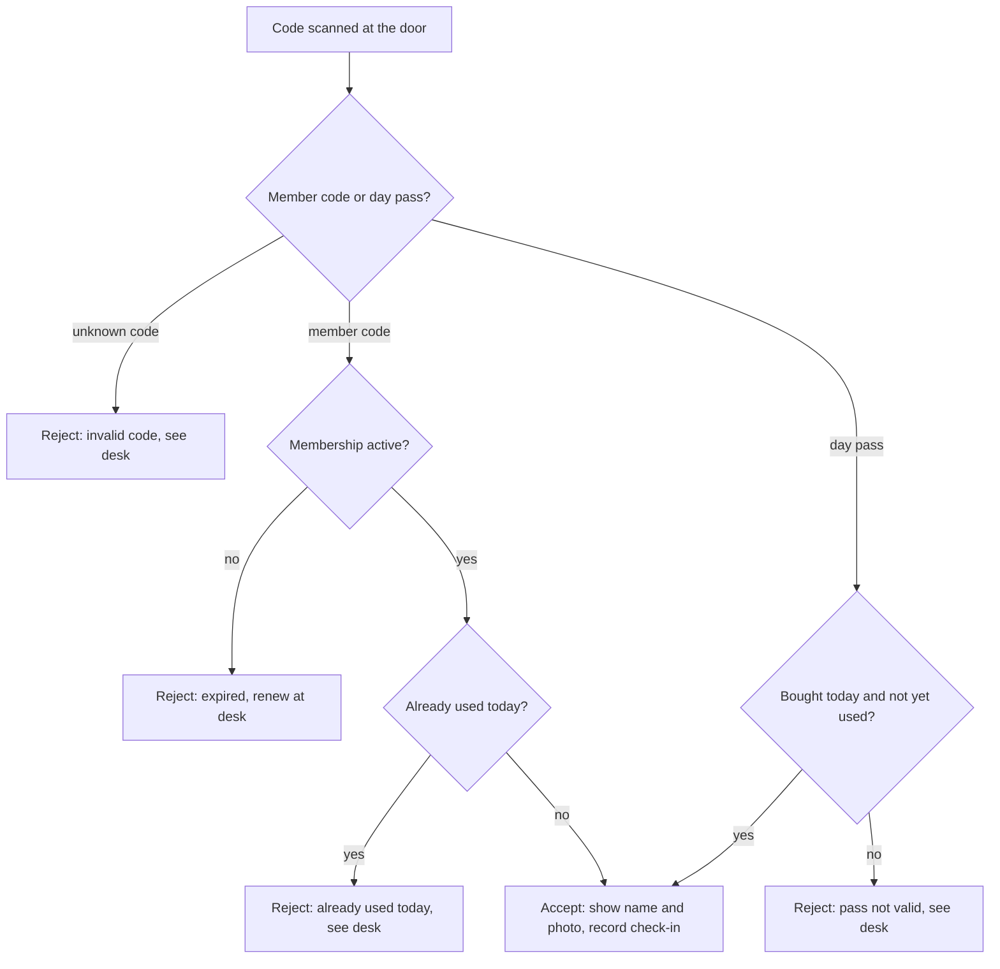
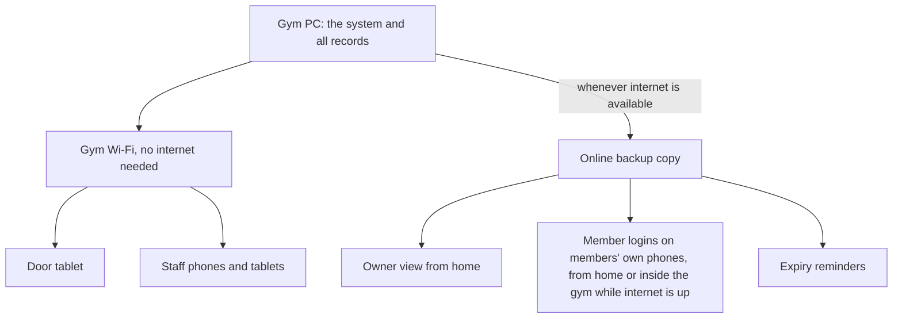
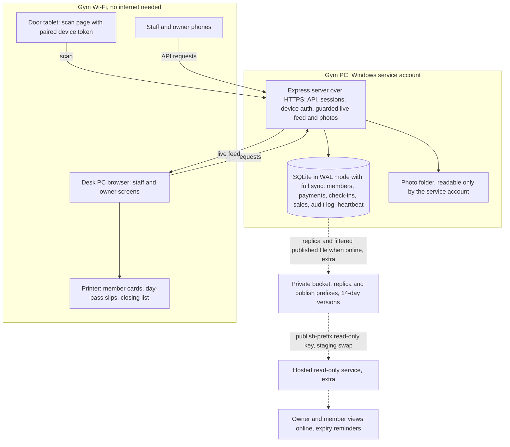
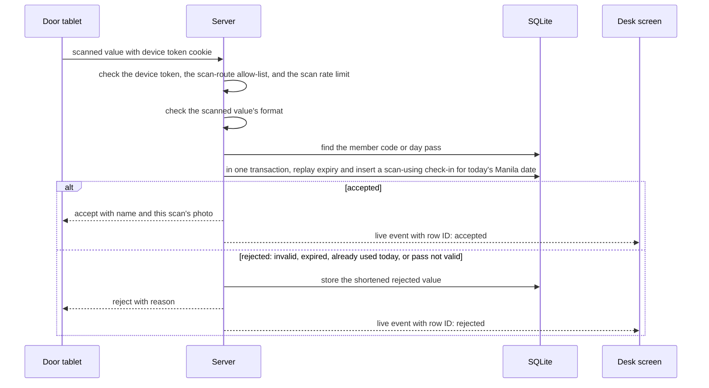
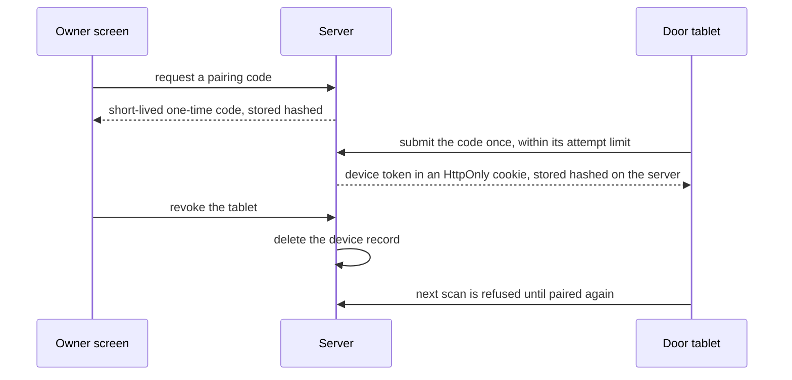
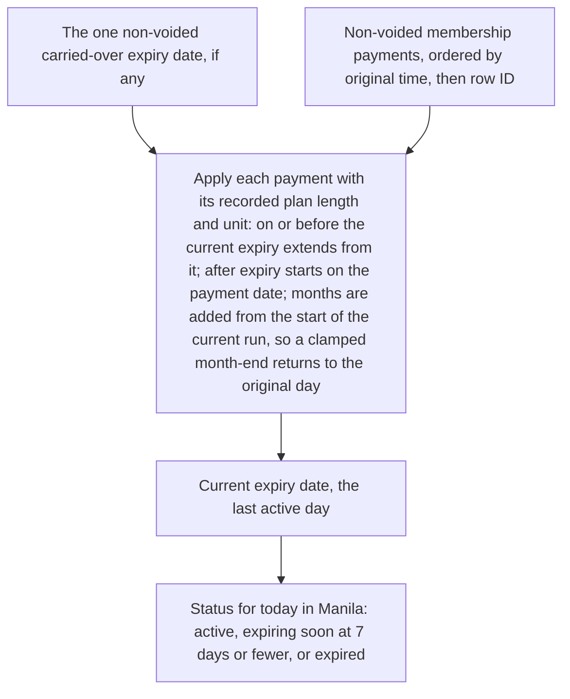
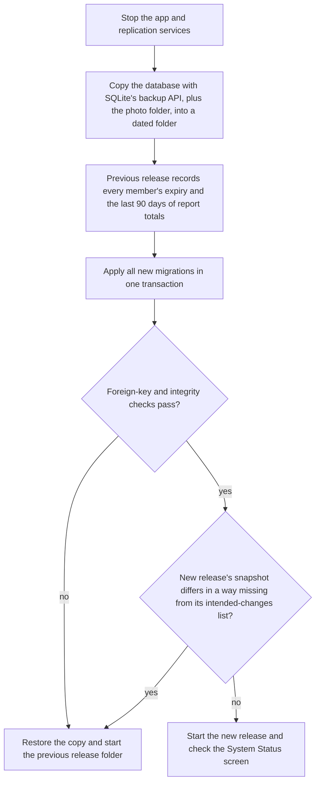
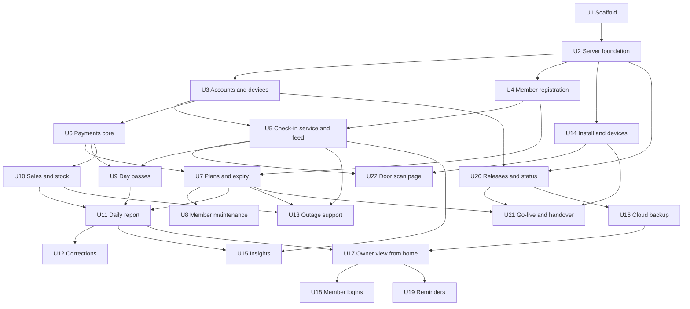

# Jeyo's Hardhit Gym Management System - Plan

## Goal Capsule

- **Objective:** Staff and the owner of Jeyo's Hardhit Fitness Center track memberships, check-ins, walk-in payments, sales, and stock in one system instead of logbooks and a wall list, and the gym keeps checking people in and selling when its internet is down.
- **Means:** A TypeScript web app (Node.js with Express, React, SQLite) running as a Windows service on the gym PC over local HTTPS (KTD1, KTD3, KTD11).
- **Product authority:** This Product Contract, built from the team's one-page concept paper ("Initial Project Concept: Jeyo's Gym Management System") and the client discussion it records. The Planning Contract governs how it is built: requirements win on product behavior, and Key Technical Decisions win on mechanism.
- **Execution profile:** A three-student team over one semester. The team builds the foundation together, then a thin working path from registration to door check-in, then three parallel tracks, then the extras in the cut order of R40.
- **Stop conditions:** Stop and revisit this plan if the door tablet cannot scan over local HTTPS on the real hardware after the KTD4 fallback, if the course does not accept rule-based insights as the AI feature, or if the owner's confirmed report contents or back-entry rules differ from R28 and R48.
- **Who finishes:** The team writes the code, commits, opens and reviews pull requests, and merges. No automated agent commits, pushes, or opens pull requests.
- **Open blockers:** None.

---

## Product Contract

### Summary

A gym management web app that runs on the gym's own PC and works on any phone, tablet, or computer on the gym Wi-Fi without internet.
The core covers members on owner-defined plans with color-coded expiry, QR check-in at a door tablet, walk-in day passes, and product and shake sales with stock counts.
After the core, extras are built in a fixed order and cut from the end if the semester runs short: offline owner insights, cloud backup, the owner's view from home, member logins, and expiry reminders.
It is built as a TypeScript web app that runs as a Windows service on the gym PC over local HTTPS, starting with a thin working path from member registration to door check-in.

### Problem Frame

Jeyo's Hardhit tracks memberships in logbooks, so finding one member means flipping through page after page.
Expiry dates are written on a wall, and keeping that list current is a chore.
Stock of protein powder, creatine, and energy drinks is counted by hand, and every sale is written down, including whether a protein shake had banana, egg, or both.
Members skip signing the logbook when they come in, and some non-members use the gym and leave without paying.
The owner has no current view of who is paid up, who trained today, or what sold.
The gym's internet can drop, and the concept paper requires check-in to keep working when it does.

### Actors

- A1. Owner or manager: sets plans and prices, manages stock and staff accounts, reads reports and insights, and checks the business from home.
- A2. Front-desk staff: registers members, takes payments, sells products and shakes, sells walk-in day passes, and checks people in from the desk.
- A3. Member: shows a QR code at the door and, once member logins exist, views their own code, expiry, and visits online.
- A4. Walk-in customer: pays for a single day and enters with a day pass.
- A5. Door tablet: a tablet or spare phone at the entrance that scans codes and shows the result.

Trainers are not actors in this version (see Scope Boundaries).

### Key Decisions

- **The gym PC is the server; devices reach it over the gym Wi-Fi.** Internet is needed only for the online extras. Governs R1, R2, R5. (session-settled: user-directed — chosen over per-device copies that sync later and over an online-first hosted system: avoids conflicting records between devices and dependence on paid hosting.)
- **From-home screens read the online backup copy and show when it was last updated.** Governs R36, R38. (session-settled: user-directed — chosen over a live connection to the gym PC: from-home features keep working at night and during outages, at the cost of data that can lag.)
- **Walk-ins pay before entering and get a one-day QR pass.** Governs R19, R20, R21. (session-settled: user-directed — chosen over logging a visit to be paid before leaving and over a scanner-controlled door lock: needs no hardware purchase, and front-desk staff make sure every walk-in pays.)
- **Codes are scanned by a door tablet, with check-in by name at the desk as the fallback.** Governs R13, R14, R16. (session-settled: user-directed — chosen over a door tablet with no fallback and over staff scanning everyone at the desk: fast at busy times and still handles forgotten codes.)
- **A member code works once per day; the door shows the member's photo and staff can override at the desk.** Governs R14, R15, R16. (session-settled: user-directed — chosen over blocking a code only while the member is inside and over phone codes that change every 30 seconds: cheap to build and matches the rule the client already heard.)
- **Membership plans are time-based and defined by the owner.** Governs R6, R7. (session-settled: user-directed — chosen over a fixed monthly plan plus day pass and over visit-count packs: covers student rates and promos without code changes.)
- **Sealed items carry stock counts; shakes are logged with add-ons but do not deduct ingredients.** Governs R22, R23, R24, R25. (session-settled: user-directed — chosen over recipe-based ingredient deduction and over a sales log with no stock: solves the stock problem without recipe math that drifts when bananas spoil.)
- **Payments are cash or GCash/Maya, with the e-wallet reference number typed in by staff.** Governs R27. (session-settled: user-directed — chosen over cash only and over automatic online payment confirmation: works offline and needs no payment-provider verification or fees.)
- **The AI feature is offline owner insights: renewal-risk alerts and stock run-out predictions.** Governs R29, R30, R31, R32, R33. (session-settled: user-directed — chosen over a face check at the door, which the user dropped, and over logbook-page scanning, an ask-your-gym assistant, and a busy-hours forecast: runs without internet and protects renewal and sales income.)
- **All extras stay planned and are built after the core in a fixed cut order.** Governs R39, R40. (session-settled: user-directed — chosen over a fixed smaller first version of core, insights, backup, and owner remote view: the team wants the full scope, accepting that the demo scope is settled late.)
- **Trainer features wait for a later version.** (session-settled: user-directed — chosen over trainer client lists with paid sessions, a view-only client list, and full coaching tools: keeps the first version on the problems from the client discussion.)
- **Early renewals extend from the old expiry date; late renewals start on the payment date.** Members who renew early lose no days. Governs R11.
- **Members use their own phones only through the online service.** Members set their password on a gym device at the desk and view their code, expiry, and visits online, which also works inside the gym while its internet is up. Governs R37, R43. (session-settled: user-directed — chosen over member phones reaching the gym PC over the gym Wi-Fi and over no member self-view in this version: members' phones never show certificate warnings and never need the gym's certificate authority.)
- **A monthly renewal after a month-end clamp returns to the member's original day.** An expiry of January 31 renews to February 28, then to March 31. Governs R55. (session-settled: user-directed — chosen over staying on the clamped day: a member whose expiry falls on the 29th to 31st does not lose days every year.)

### Requirements

**Setup and access**

- R1. The system runs on one computer at the gym, and every in-gym feature works over the gym Wi-Fi with no internet connection.
- R2. Staff and the owner use it from any phone, tablet, or computer on the gym Wi-Fi that has a web browser.
- R3. The owner and each front-desk staff member sign in with their own account.
- R4. Staff can register members, record payments and sales, and check people in, but cannot change prices or plans, delete records, or manage accounts.
- R5. When the gym Wi-Fi fails, staff can still check people in, record payments, and sell directly on the gym PC.
- R41. The owner can correct or void a mistaken sale, payment, or check-in, recording the original values, who made the change, and when, and the correction carries through to stock counts, that day's already-used status, the daily report, and insights.
- R42. The door tablet runs in a scan-only mode, set up and revocable by the owner, that can submit scans and show results but cannot open member records, payments, sales, or staff screens.
- R45. At a closing time the owner sets, the system prints a list of active members and their expiry dates, which staff use to check members in by name during a power outage.
- R46. After a power outage, staff can enter paper-logged check-ins, payments, and sales with their original times, and each entry is marked as entered after the outage with the staff account that entered it.
- R48. A record entered after an outage counts at its original time for renewal dating (R11) and the once-per-day rule (R15), and staff can back-enter only the last 24 hours, with anything older requiring the owner.
- R49. On a fresh install, a setup screen that works only on the gym PC itself creates the owner account and prints a one-time recovery code for resetting the owner password without internet.
- R50. The owner adds, disables, and resets staff accounts, and a disabled account can no longer sign in but keeps its name on past records.
- R51. The owner pairs the door tablet with a one-time code, and revoking it (R42) ends its access immediately.
- R52. An owner or staff sign-in ends after a period of inactivity, so a shift change does not leave records under the previous person's account.
- R56. The gym PC's clock, in Manila time, defines the calendar day for check-ins, day passes, expiry dates, and the daily report.

**Members and plans**

- R6. The owner creates and edits membership plans, each with a name, price, and a length in days or months (for example Monthly, Student Monthly, 3-Month), and sets the walk-in day-pass price.
- R7. Changing a plan's price does not change amounts recorded on past payments.
- R8. Staff register a member with name, contact details, and a photo, recording the member's consent to storing that data on the gym PC, keeping an online backup copy, and receiving expiry reminders; a member who declines a photo can still register.
- R9. Each member gets a unique, unguessable QR code that staff can print on a card or send to the member as an image, and staff can replace it with a new code that makes the old one invalid at the door.
- R10. The member list marks each member's status with a color: active, expiring soon (7 days or fewer left), or expired.
- R11. A renewal paid on or before the expiry date extends from the old expiry date; a renewal paid after expiry starts on the payment date.
- R12. The desk shows a list of members who are expiring soon.
- R44. The owner can register an existing member with an expiry date carried over from the logbook or wall list, marked as carried over, recording who entered it, and not counted as income in the daily report.
- R47. A member's expiry date is always recalculated from their non-voided membership payments in order, starting from any carried-over date (R44), and voiding a day-pass payment makes that pass invalid.
- R55. The expiry date is the member's last active day. A plan length in months that would land past the end of a shorter month ends on that month's last day (January 31, 2027 plus one month is February 28, 2027), and the next on-time monthly renewal returns to the original day (March 31, 2027).
- R59. Staff can update a member's contact details and photo, only the owner can change a member's name, and every change is logged.
- R60. Plans are retired rather than deleted, and changing a plan's length or price affects only future renewals.
- R62. The owner can permanently erase a former member's personal data on request, removing their name, contact details, photo, and code while keeping their payments and check-ins as anonymous records in reports.

**Check-in**

- R13. A tablet or spare phone mounted at the entrance scans member QR codes and walk-in day passes.
- R14. After each scan, the door screen and the desk screen both show the person's name, their photo when one is on file, and an accept or reject result with the reason.
- R15. A member code is accepted once per calendar day; a second scan that day is rejected with a message that the code was already used today.
- R16. Staff can check an active member in from the desk by name, including a same-day second visit that R15 rejected at the door, while an expired member must renew first.
- R17. An expired member's code is rejected at the door with a message to renew at the desk.
- R18. Every accepted check-in is recorded with its date and time, and a desk check-in also records the staff account that made it.
- R53. Member codes and day passes are random tokens that cannot be worked out from a name, member number, or another code, and a replaced member code (R9) is rejected at the door as an invalid code.
- R54. The server accepts door scans only from a paired door tablet (R51).
- R57. Any accepted check-in, from the door or the desk, uses up that member's scan for the day, and two check-ins for the same member at the same moment cannot both be accepted.
- R58. Every rejected door scan is stored, so a desk check-in can be linked to the rejection it overrode (R28).



**Walk-ins**

- R19. A walk-in pays at the desk before using the gym, and the recorded payment produces a one-day QR pass as a printed slip or an image on the customer's phone.
- R20. A day pass is accepted at the door once, only on the day it was bought, and staff can re-admit its holder at the desk later that same day.
- R21. The daily report lists each walk-in's day-pass payment and door entry so staff and the owner can track walk-in payments.

**Sales and stock**

- R22. The owner maintains a product list with prices, and sealed items (for example energy drinks, bottled water, supplement tubs) carry a stock count.
- R23. Selling a sealed item lowers its stock count and warns at a low-stock level the owner sets for that product, and a sale of an item already at zero still goes through with a separate out-of-stock warning.
- R24. Shakes are sold as menu items with optional priced add-ons (for example banana, egg), and each sale records the add-ons chosen.
- R25. Shake sales do not deduct bulk ingredients such as protein powder, bananas, or eggs.
- R26. The owner records restocks, which raise stock counts and build a purchase history.

**Payments and reports**

- R27. Every payment records its method, cash or e-wallet (GCash or Maya), and the staff account that entered it, and an e-wallet payment requires a reference number that is not already on file.
- R28. The daily report shows sales split into cash and e-wallet, membership and day-pass income, product and shake sales, check-in counts, the walk-in payments and entries from R21, members expiring soon, low-stock items, each e-wallet payment with its reference number and the staff account that entered it, each desk check-in with the staff account that made it and any door rejection it overrode, and each record entered after an outage.
- R61. When a correction or after-outage entry changes an earlier day, that day's report recalculates and marks that it changed after closing.

**Owner insights (runs offline)**

- R29. Owner insights run on the gym PC without internet.
- R30. Insights flag members at risk of not renewing, based on a drop in how often they visit, so the owner can contact them before they expire.
- R31. Insights predict when each stocked product will run out, based on its recent sales rate.
- R32. Until there is enough check-in and sales history for a prediction, insights say more data is needed instead of showing one.
- R33. A demo mode loads sample history for presenting insights, kept separate from the gym's real records.

**Online extras (need internet)**

- R34. Whenever the gym PC has internet, it copies the gym's data to an online backup automatically, and the owner can restore that backup onto a replacement PC.
- R35. The owner can view today's sales, attendance, stock, and expiring members from any internet-connected device, without editing.
- R36. Every from-home screen reads the online backup copy, shows when that copy was last updated, and keeps working while the gym PC is off or offline.
- R37. Members sign in to the online service to see their QR code, expiry date, and visit history, from home or inside the gym while its internet is up, first setting their own password on a gym device at the desk with a one-time code staff give them.
- R38. Members receive a reminder by SMS or email shortly before their membership expires and again when it has expired, sent from the online copy only after its first update on or after the day the reminder comes due, so a reminder that comes due while the gym PC is off goes out after the PC next connects.
- R43. Only the owner's sign-in and member sign-ins can read the online copy, and a signed-in member sees only their own code, expiry date, and visits.



**Build order**

- R39. The core (R1 through R28, plus R41, R42, R44, and R45 through R62) is finished and tested before any extra starts.
- R40. Extras are built in this order and cut from the end if the semester runs short: owner insights R29 to R33, then cloud backup R34 with the owner half of R43, then owner view from home R35 and R36, then member logins R37 with the member half of R43, then expiry reminders R38.

### Key Flows

- F1. Member check-in at the door
  - **Trigger:** A member arrives with a printed card or a code on their phone.
  - **Actors:** A3, A5, A2
  - **Steps:** The member scans at the door tablet; the screen shows their name, photo, and result; an accepted scan records the check-in; a rejected member goes to the desk, where staff renew an expired membership or check an active member in by name.
  - **Outcome:** Every door scan and desk check-in is recorded without a logbook.
  - **Covered by:** R13, R14, R15, R16, R17, R18
- F2. Walk-in visit
  - **Trigger:** A non-member wants to train for the day.
  - **Actors:** A4, A2, A5
  - **Steps:** The walk-in pays at the desk; staff record the method and any e-wallet reference number; the walk-in receives a day pass and scans it at the door.
  - **Outcome:** The entry and the payment both appear in the daily report.
  - **Covered by:** R19, R20, R21, R27
- F3. Membership renewal
  - **Trigger:** A member appears on the expiring-soon list or is rejected at the door as expired.
  - **Actors:** A3, A2
  - **Steps:** The member pays at the desk; staff record the payment against a plan; the new expiry date is set per R11; the member's status color updates.
  - **Outcome:** The member's next door scan is accepted.
  - **Covered by:** R10, R11, R12, R27
- F4. Selling a shake and a product
  - **Trigger:** A customer orders a protein shake with banana and egg and an energy drink.
  - **Actors:** A2
  - **Steps:** Staff add the shake with its add-ons and the energy drink to the sale, pick the payment method, and record it.
  - **Outcome:** The sale and add-ons are recorded, energy-drink stock drops by one, and a low-stock warning appears if it reaches its low-stock level.
  - **Covered by:** R22, R23, R24, R25, R27
- F5. Owner's end-of-day review
  - **Trigger:** The gym closes for the day.
  - **Actors:** A1
  - **Steps:** The owner opens the daily report, counts the cash drawer against the cash total, matches e-wallet payments against the GCash and Maya transaction history, reviews the day's walk-in payments and entries, and checks low-stock items; once owner insights are built, the owner also reviews at-risk members and predicted stock-outs.
  - **Outcome:** Missing cash, the day's walk-in payments, and low stock are visible the same day.
  - **Covered by:** R21, R27, R28, R30, R31
- F6. Working through a power outage
  - **Trigger:** The power goes out and the gym PC and router are down.
  - **Actors:** A2, A3, A4
  - **Steps:** Staff check arriving members against the latest printed active-member list; staff write each check-in, payment, and sale on paper; when power returns, staff enter the paper records with their original times.
  - **Outcome:** No visit, payment, or sale from the outage is lost, and the daily report flags the late entries for the owner.
  - **Covered by:** R28, R45, R46
- F7. First-run setup
  - **Trigger:** The system is installed on the gym PC for the first time.
  - **Actors:** A1, A5
  - **Steps:** The owner opens the setup screen on the gym PC, creates the owner account, and keeps the printed recovery code; the owner adds staff accounts; the owner pairs the door tablet with a one-time code.
  - **Outcome:** Staff can sign in, and the door tablet's scans are accepted.
  - **Covered by:** R3, R49, R50, R51, R54

### Acceptance Examples

- AE1. **Covers R15, R16, R18.** **Given** a member checked in at 6:00 AM, **when** they scan again at 6:00 PM, **then** the door rejects the code as already used today, and staff at the desk can check them in by name with the check-in recorded under the staff account.
- AE2. **Covers R14, R15.** **Given** a friend scans a screenshot of a member's code at 7:00 AM, **when** the door accepts it, **then** the door and desk screens show the real member's photo so staff can spot the mismatch, and the real member's scan later that day is rejected and sent to the desk.
- AE3. **Covers R11.** **Given** a Monthly membership that expires on September 30, **when** the member renews on September 25, **then** the new expiry is October 30; **when** they instead renew on October 5, **then** the new expiry is November 5.
- AE4. **Covers R10.** **Given** today is September 15, **when** a membership expires on September 22, **then** it shows as expiring soon; **when** it expires on September 23, **then** it shows as active.
- AE5. **Covers R20.** **Given** a day pass bought on September 15, **when** it is scanned a second time that day or scanned on September 16, **then** the door rejects it.
- AE6. **Covers R23.** **Given** an energy drink with 6 in stock and a low-stock level of 5, **when** one is sold, **then** stock shows 5 and a low-stock warning appears.
- AE7. **Covers R8, R14.** **Given** a member who declined a photo at registration, **when** they scan at the door, **then** the screen shows their name and result without a photo.
- AE8. **Covers R32.** **Given** the system has recorded one week of check-ins and sales, **when** the owner opens insights, **then** they see that more data is needed rather than predictions.
- AE9. **Covers R36.** **Given** the gym's internet is down from 4:10 PM, **when** a member renews at 6:00 PM and the owner checks from home at 7:00 PM, **then** the owner's screen shows "last updated 4:10 PM" without the renewal, and the renewal appears after the gym PC reconnects.
- AE10. **Covers R15, R46.** **Given** a member was checked in on paper at 7:00 AM during a power outage, **when** staff enter that check-in at 9:00 AM after power returns, **then** it shows a 7:00 AM check-in marked as entered after the outage, and the member's door scan later that day is rejected as already used today.
- AE11. **Covers R41, R47.** **Given** a Monthly membership that expires on September 30, renewed on September 25 (new expiry October 30) and again on October 28, **when** the owner voids the September 25 payment, **then** the October 28 renewal counts as late and the expiry becomes November 28.
- AE12. **Covers R11, R48.** **Given** a membership that expires on September 30, **when** a paper renewal taken at 5:00 PM on September 30 during an outage is entered at 9:00 AM on October 1, **then** it counts as an on-time renewal and the new expiry is October 30.
- AE13. **Covers R48.** **Given** a paper sale from 30 hours ago, **when** a staff member tries to enter it, **then** the entry is refused and the owner can enter it instead.
- AE14. **Covers R55.** **Given** a Monthly membership that expires on January 31, 2027, **when** the member renews on January 30, **then** the new expiry is February 28, 2027.
- AE15. **Covers R57.** **Given** an active member not yet checked in today, **when** the door tablet and the desk check them in at the same moment, **then** only one check-in is accepted and the other is rejected as already used today.
- AE16. **Covers R55.** **Given** a Monthly membership whose January 31, 2027 expiry was renewed on time to February 28, 2027, **when** the member renews again on February 27, **then** the new expiry is March 31, 2027.

### Scope Boundaries

**Deferred for later**

- Trainer accounts, client assignment, and paid personal-training sessions.
- Visit-count packs (for example 12 visits within 2 months).
- Automatic confirmation of GCash or Maya payments through a payment provider.
- Door locks or turnstiles controlled by the scanner.
- Recipe-based deduction of shake ingredients.
- Editing records from the owner's from-home view.

**Deferred to Follow-Up Work**

- A routine scheduled local database copy to a USB drive; the review kept routine backup in the extras (U16), while the copy taken before each update is part of U20.
- Resetting a forgotten member password from home; resets happen at the desk under KTD13.
- A dedicated USB or Bluetooth hardware QR scanner purchase, needed only if camera scanning proves unreliable on the door tablet (KTD4).

**Outside this product's identity**

- Coaching tools such as workout plans and progress notes; the product runs the gym's front desk and business, not members' training.
- Face recognition at the door, which the team dropped; the photo shown on the door screen (R14) is the anti-sharing check.
- Other AI features considered and not chosen: logbook-page scanning, an ask-your-gym assistant, and a busy-hours forecast.

### Dependencies and Assumptions

- Jeyo's already has a desk PC or laptop, a Wi-Fi router, and an internet plan; the gym still needs a tablet or spare phone for the door.
- Browsers let a web page use the camera only over a secure connection, so planning must make the door tablet's camera scanning work on the gym network without internet.
- The gym PC stays on during opening hours; the online copy refreshes only while it is on and connected.
- If the router fails, the door tablet cannot reach the gym PC, so check-in moves to the desk (R5).
- A staff member is always at the front desk during opening hours and makes sure every walk-in pays before entering. The system supports this by showing every door scan, including rejected codes, on the desk screen (R14) and recording each walk-in's payment and entry (R21), but it cannot detect a walk-in who never reaches the desk or the scanner.
- Check-in records are complete only if staff require every member to scan at the door or be checked in at the desk; a member who walks past the scanner leaves no record and can look like a drop in visits under R30.
- Member personal data and photos, including the online copy, fall under the Philippine Data Privacy Act of 2012, Republic Act No. 10173, which is why R8 captures consent at registration and R62 honors erasure requests.
- Owner insights need roughly 1 to 2 months of real check-ins and sales before predictions are useful, so the class demo uses the sample data from R33.
- The working system is due in one semester, about 4 months, built by a three-member team.
- The course mandates no programming language or framework; planning chooses one with the team's skills in mind.
- The three-member team commits, pulls, and pushes the code themselves; planning should not rely on an automated agent committing code or opening pull requests.
- Customers send GCash and Maya payments only to an account the owner controls, so the owner can match e-wallet payments against its transaction history.
- The gym has, or will get, a printer for the closing-time member list in R45.
- Report contents in R28 are inferred from the client discussion and have not been confirmed with the owner.
- The month-end renewal rule in R55 is the team's choice and has not been confirmed with the owner.
- Member logins (R37) need internet even inside the gym, because members' own phones use only the online service.
- The gym is assumed to be small, with hundreds of members rather than thousands; actual member, visitor, and product counts were not gathered.

### Outstanding Questions

**Resolve Before Planning**

- None.

**Deferred to Planning**

- For R38: whether reminders go by SMS, which costs per message, or by email, and how many days before expiry the first one goes out.
- Which reports matter most to the owner, to confirm R28 with the client.
- For R8 and R44: how members carried over from the logbook give their consent, since they were not present at registration; settle with the owner before go-live (U21).
### Sources

- Team concept paper, "Initial Project Concept: Jeyo's Gym Management System" (Casas, Amatiaga, Maglasang), kept outside the repo: the client discussion problems, the once-per-day QR rule, and the offline check-in requirement.
- Philippine Data Privacy Act of 2012 (Republic Act No. 10173): the basis for consent at registration.

---

## Planning Contract

**Product Contract preservation:** changed. R62 (owner erasure of a former member's personal data) was added after the user confirmed it during plan scoping, and R39 now lists it in the core. After the document review, the user decided that members' own phones use only the online service, which reworded R37 and R43, and that monthly renewals return to the original day after a month-end clamp, which extended R55 and added AE16. The Summary gained one sentence on the build approach. KTD12 and KTD13 resolve the former open questions on insight thresholds and online sign-in storage, and a new open question asks how members carried over from the logbook give consent. Every other requirement keeps its meaning and ID.

### Key Technical Decisions

- KTD1. **TypeScript full stack: Node.js 24 LTS with Express 5, React 19 with Vite, and SQLite, in one repo of npm workspaces laid out per KTD16.** One language covers the server, the desk and owner screens, and the camera code the door tablet must run in the browser. Governs R1, R2. (session-settled: user-directed — chosen over a Python FastAPI backend with React and over a C# ASP.NET Core backend with React: the team knows TypeScript, and the browser camera code is JavaScript either way.)
- KTD2. **SQLite through `better-sqlite3` with Drizzle ORM, both pinned to exact versions, set up for a desk PC that can lose power.** Every connection turns on WAL mode, foreign keys, `secure_delete`, a 5-second busy timeout, and `synchronous = FULL`. SQLite documents that WAL with `NORMAL` can roll back recently committed transactions after a power loss, and the gym's write volume is tiny. The schema has no cascading deletes, and each module keeps its own schema file in `packages/domain/src/schema`, re-exported from one index, while `packages/server` keeps the Drizzle config and the generated migrations. Member photos live in a folder on disk under server-generated names and are served only through guarded routes (KTD6). Node's built-in `node:sqlite` and Prisma's current tag are both release candidates, so both were passed over for a PC that runs unattended.
- KTD3. **Local HTTPS with a local certificate authority trusted on every gym device and limited by X.509 name constraints to the gym PC's hostname, its reserved LAN address, and `localhost`.** mkcert cannot add name constraints, so the authority is created with OpenSSL, and even a copied authority key cannot sign trusted certificates for other websites. The certificate is renewed about every two years by following the runbook. After issuing it, the authority's private key leaves the gym PC and the owner keeps it offline, because anyone holding that key can impersonate any website to the staff phones that trust it. A public Let's Encrypt certificate was rejected because renewal needs internet, and browsers only open the camera on secure pages. Only the gym's own devices and the owner's and staff phones trust the authority. Members' phones never install it, and members reach their details only through the hosted service (R37).
- KTD4. **The door tablet scans with the browser's built-in `BarcodeDetector`, loading the `barcode-detector` polyfill where the detector is missing or cannot read QR codes.** The polyfill's WebAssembly file is bundled with the client instead of fetched from a CDN, so scanning works with no internet, and the scan page's content security policy allows `wasm-unsafe-eval`. The same scan page also accepts typed input, so a USB or Bluetooth keyboard-style QR scanner can replace the camera without code changes. The older QR libraries `html5-qrcode` and `zxing-js` are unmaintained.
- KTD5. **Owner and staff use server-side sessions stored in SQLite, and the door tablet uses a paired device token held in an `HttpOnly` cookie.**
  - Passwords are hashed with argon2id, with `bcryptjs` as the fallback if the native install fails, and cookie-authenticated writes carry a CSRF synchronizer token.
  - Sign-ins, one-time codes, and scans are rate-limited per account, code, or device, with counters and pairing codes stored in SQLite so a restart does not reset them.
  - Every one-time code (recovery, pairing, member access) is random, stored hashed, and has a fixed length, an expiry, and an attempt limit.
  - "On the gym PC itself" is decided from the connection's own address, ignoring forwarded headers, with an allow-list for the Host and Origin headers. Setup also requires a secret that the install script writes to the data folder.
  - Recovery works only on the gym PC and ends every owner session.
  - The device token works only on scan routes, and the owner sees each device's last scan time and address.

  Governs R3, R4, R42, R49, R50, R51, R52, R54.
- KTD6. **Every route, including the desk live feed and photo requests, declares its allowed roles where it is defined, and one guard denies any route without a declaration.** The permission test discovers routes from the router and checks each one against owner, staff, door device, member, and signed-out requests. Hiding buttons in the React app is not an access control.
- KTD7. **Money is stored as integer centavos parsed from decimal text, and times are stored in UTC.** Amounts are never converted by multiplying a JavaScript number, because ₱1.15 × 100 is not exactly 115. Every record stores its original time, its entry time, and its Manila date, which one shared helper computes from the original time with Luxon. Plan-length math uses Luxon's month addition, which ends on the last day of shorter months. Replay adds the total months since the current run of on-time renewals started to that run's start date, so a clamped February 28 renews to March 31 rather than March 28. A late renewal, a carried-over date, or a plan length in days starts a new run. When the clock is earlier than the latest stored record, the server refuses new records and shows a fix-the-clock screen until the owner confirms the time. Governs R55, R56.
- KTD8. **Membership state is derived, not stored, and every check-in has an explicit kind.**
  - Expiry is replayed from the member's one allowed non-voided carried-over entry and their non-voided membership payments. Payments are ordered by original time, then by row ID, using the plan length, unit, and price recorded on each payment.
  - A check-in is either scan-using or an override. Scan-using means a door accept, the day's first desk check-in, or a back-entered check-in. An override is a desk check-in after the day's scan is used, linked to the stored rejection it overrode.
  - A unique rule on non-voided scan-using check-ins per member per stored Manila date enforces once per day and stops simultaneous door and desk attempts. Overrides and same-day day-pass re-admissions do not count toward it.
  - A second unique rule allows one door entry per day pass.
  - Voiding the scan-using check-in frees the day's scan, and any override stays on record.

  Governs R11, R15, R16, R20, R44, R47, R57.
- KTD9. **One append-only audit log, written in the same transaction as the change it records, with personal before-and-after values kept in a separate table.** Database triggers refuse updates and deletes on both tables. The one exception is an R62 erasure, which redacts the member's personal values. The log covers corrections, voids, desk overrides, carried-over entries, after-outage entries, refused back-entries, member edits, and erasures. Governs R41, R44, R46, R48, R59, R62.
- KTD10. **The desk screen receives door results through Server-Sent Events that require an owner or staff session.** Each event carries an ID from one door-event sequence shared by accepted check-ins and rejected scans, so the two kinds never share an ID. After a reconnect or server restart, the desk resumes from the last ID it saw and reloads today's rejections over the normal API. An open feed and automatic reloads never count as session activity for R52. When the session ends or the account is disabled, the feed closes and the desk shows a full-screen sign-in prompt saying door results are paused; after sign-in the feed resumes and highlights the scans that arrived meanwhile. Every rejected scan is stored for R58, after the scanned value is checked for format and shortened, and screens render it only as plain text.
- KTD11. **The server runs as a Windows service through NSSM, under its own Windows account, restarting after crashes and starting on boot.** The data folder is readable only by that account. `node-windows` is a stale beta, and PM2 has no maintained way to run as a Windows service.
- KTD12. **Owner insights are transparent rules, not a trained model.** A member is at risk when their weekly visit rate over the last 14 days (visits divided by 2) falls below half of their weekly average over the previous 8 weeks and their membership expires within 30 days. A product's days of stock left come from its average daily sales over the last 14 days. Thresholds live in owner settings (KTD18), and demo mode applies only to insights routes, never to scans or sales. Insights say more data is needed until a member has 4 weeks of history or a product has 14 days of sales. Governs R29, R30, R31, R32, R33. (session-settled: user-approved — chosen over a trained machine-learning model: with a few hundred members and a few months of data, rules match or beat a model and can be explained to the owner.)
- KTD13. **Online extras replicate the gym PC's database to a private bucket with Litestream, and a small hosted service publishes a filtered, read-only copy from it.**
  - The gym PC's replication key can write and delete current objects but cannot delete object versions or change bucket settings. Litestream keeps at most 14 days of snapshots, versioning keeps deleted or overwritten objects recoverable for 14 days before a lifecycle rule expires them, and public access is blocked.
  - The gym PC runs a publish job with `packages/domain` that builds a filtered published database: each member's replayed expiry date, their own code and visit history, daily report totals, the owner and member password hashes, and the heartbeat. It uploads that file to a separate publish prefix. Staff accounts, sessions, devices, codes, audit tables, and payment detail never leave the gym PC in it.
  - The hosted service's key can read only the publish prefix. The full replica is readable only with an owner-held restore key kept offline for restores (U16).
  - The hosted service downloads the published file into a private staging file, checks its integrity and schema version, and swaps it in atomically. "Last updated" is the newest heartbeat in that file, which the gym PC writes every five minutes.
  - The hosted service's own database keeps online-only records such as the reminder send log, so swaps never overwrite them. It rate-limits sign-ins, times out idle sessions, and ends a user's sessions when their password hash changes.
  - Bucket, host, and email or SMS provider keys never appear in committed files. The gym PC's services read them from environment variables loaded from the data folder, and the hosted service reads them from the host's secret settings.
  - Member password hashes live on the gym PC and reach the online copy with the next publish. Consent recorded at registration under R8 covers the online copy.

  Governs R34, R35, R36, R37, R38, R43. (session-settled: user-approved — chosen over separate online member accounts: a member who forgets their password gets a new one-time code at the desk instead of resetting from home.)
- KTD14. **The core starts with a thin working path, then splits into three parallel tracks.** The path is register a member, print their code, scan it at the door, and see the result on the desk screen. It proves camera scanning and the check-in rules on real hardware before the rest of the core builds on them. The contracts every track relies on are fixed before the tracks split: check-in kinds (U5), the payment entry contract (U6), settings and module schema files (U2), and the client navigation shell with its owner and staff screen groups (U3). Governs R39.
- KTD15. **Testing uses Vitest, Supertest, React Testing Library, and Playwright.**
  - Vitest covers shared rules, domain rules, and server services against a temporary SQLite file per test file.
  - Supertest covers routes and the KTD6 permission matrix, and React Testing Library covers key screens.
  - Playwright covers the scan path end to end, feeding a recorded QR video to a fake camera.
  - A migration upgrade test applies new migrations to a database built by the previous release.
  - A GitHub Actions check runs type checks, lint, and tests on every pull request.
- KTD16. **Five npm workspaces with one-way dependencies.**
  - `packages/shared` holds browser-safe code: request schemas, money, the Manila-day helper, and role names.
  - `packages/domain` holds the Drizzle table definitions, pure rules, and read queries: expiry replay, status, check-in rules, and report aggregation.
  - `packages/server` runs at the gym, `packages/client` holds the React screens, and `packages/online` is the hosted service.
  - Both servers import `domain` and `shared`, and neither server imports the other, so from-home views and reminders use the same expiry rules as the gym.
- KTD17. **Releases move the database forward only, with the services stopped and a verified way back.** From the go-live baseline (U21), migrations only add; before go-live there is no live data, so the team may squash and regenerate migrations. Each pull request carries at most one migration, regenerated after rebasing on main, and CI fails when the schema and migrations drift apart. The schema version is stored in the database, and older code refuses to start on a newer schema. The previous release records the before snapshot and the new release records the after snapshot. Each release lists any intended changes to expiry dates or report totals, and only differences missing from that list restore the copy. Pre-update copies stay in the service-account data folder and are deleted 14 days after their release is confirmed. The update sequence is in the release diagram below. Confirm on the pinned Drizzle version how it rebuilds SQLite tables, since SQLite ignores foreign-key settings changed inside a transaction.
- KTD18. **One typed owner settings table, where each module registers its own keys.** It holds the day-pass price (R6), the closing time (R45), the session idle timeout (R52), and the insight thresholds (KTD12). U2 builds it, so no track waits on another for a setting.
- KTD19. **Payments and back-entries share one entry contract.** Recording a payment runs inside the caller's transaction and takes an entry context: who, the original time, and whether it is a normal or after-outage entry. The R48 window is checked once, in that context. Each owning service (payments, sales, stock, check-ins, day passes) provides its own void and back-entry operations. The corrections and outage screens only orchestrate those operations. Governs R27, R41, R46, R48.
- KTD20. **One client navigation shell and one responsive convention for every screen.** The shell built in U3 fixes the owner and staff screen groups, so each track adds its screens into a known place. Below 640 pixels wide, dense screens such as the daily report, corrections, and sales stack their sections and collapse them instead of showing wide tables. Governs R2.

### High-Level Technical Design

The gym PC holds the only live copy of the data. Every device reaches it over the gym Wi-Fi, and the online extras only read a filtered copy.



A door scan resolves in one transaction, so the door, the desk, and the database always agree on the result.



Pairing gives the unattended tablet a narrow, revocable credential instead of a staff login.



Expiry is always replayed from the membership record, which is what lets voids, corrections, and back-entries stay consistent without editing a stored date.



A release reaches the gym PC only through a sequence that can always return to the previous state (KTD17).



### Output Structure

```text
package.json                     npm workspaces and root scripts
tsconfig.base.json
eslint.config.js
vitest.config.ts
playwright.config.ts
.github/workflows/ci.yml
packages/
  shared/src/                    request schemas, money, Manila day, role names
  domain/src/                    expiry replay, status, check-in rules, report aggregation
  server/src/
    app.ts  https.ts  config.ts
    db/  settings/  http/  audit/  auth/  release/
    members/  membership/  plans/  payments/  checkins/  events/
    walkins/  sales/  stock/  reports/  corrections/  outage/
    insights/  backup/
  client/src/
    setup/  auth/  desk/  door/  owner/  print/
  online/src/                    hosted read-only service for the extras, including member logins
e2e/                             Playwright specs and fake-camera fixtures
ops/                             install, device setup, update, power-cut, backup, go-live, and handover runbooks
```

### Phased Delivery

1. **Foundation, whole team:** U1, U2, U3, and the certificate and door-tablet setup from U14. Rotate who drives each unit and review each other's pull requests.
2. **Thin working path:** U4 and U5, then U22 on the real tablet, with U6 built alongside U5.
3. **Parallel tracks, one teammate each:**
   - Members and memberships: U7, U8.
   - Check-in and walk-ins: U9.
   - Sales and stock: U10.
4. **Convergence, once U7, U9, and U10 have landed:** U11 daily report and U13 outage support, then U12 corrections, U20 releases and system status, and the rest of U14. Each track finishes its report section query and back-entry operation before this step starts.
5. **Go-live at the gym:** U21, once U20 is in.
6. **Extras in the R40 cut order:** U15, U16, U17, U18, U19.

### Risks & Dependencies

| Risk | Effect | Mitigation |
|---|---|---|
| Camera scanning fails on the real door tablet | Door check-in breaks | Prove it on the actual tablet in U22, and the scan page accepts a keyboard-style hardware scanner (KTD4) |
| The hosted service is breached | Published member data and password hashes exposed | The gym PC publishes only filtered data, the host key reads only the publish prefix, and online rate limits apply (KTD13) |
| Anyone on the gym Wi-Fi opens the live feed or photo URLs | Member names and photos collected | Feed and photos behind the session guard, with tests for signed-out and device requests (KTD6, KTD10) |
| The certificate authority key is copied from the gym PC | Fake trusted certificates on staff phones | Name-constrained authority, key kept offline after issuing, service account, and locked data folder (KTD3, KTD11, U14) |
| Stored script injection through a scanned code or a member name | Script runs in the owner's session | Strict content security policy, no raw HTML rendering, and scan format checks (U2, KTD10) |
| A migration corrupts live data | Wrong expiries or report totals | Forward-only migrations, the upgrade test, the before-and-after comparison, and a rollback drill (KTD17, U20) |
| A power cut drops recently saved records | A payment the desk showed as saved disappears | Full sync (KTD2) and the after-power-cut check in the runbook (U14) |
| The PC clock resets after a power cut | Records filed under the wrong calendar day | The server refuses new records until the owner confirms the clock (KTD7, R56) |
| No off-site copy exists if cloud backup is cut for time | A disk failure loses data since the last update copy | Copies before each update (U20); routine backup stays in the extras, as decided at review |
| Certificate trust must be set up per device and expires in about two years | Camera blocked or security warnings | Device setup guide with the extra iOS trust step, and the renewal date on the System Status screen (U14, U20) |
| The data folder sits inside OneDrive or another synced folder | Database corruption | Install check, and a warning on the System Status screen (U14, U20) |
| Native modules (`better-sqlite3`, `argon2`, `sharp`) fail to install on the gym PC | Install blocked | Prebuilt Windows binaries, a Windows install check in U1, and the `bcryptjs` fallback (KTD5) |
| Fast-moving dependencies: Drizzle is pre-1.0 and TypeScript 7 is a new compiler | Breaking changes mid-semester | Exact pins, a committed lockfile, and a toolchain check in U1 |
| Browsers cannot print without a dialog at closing time | Closing list not printed on its own | Desk prompt at closing time, plus the optional kiosk printing setting documented in U14 |
| Erased members' data survives in replicas, old photos, or pre-update copies | Erasure incomplete | `secure_delete`, deletion of current bucket objects with 14-day version expiry, and pre-update copies deleted after 14 days (KTD2, KTD13, KTD17, U8, U16, U20) |
| Wrong carried-over dates at import | Members wrongly rejected or accepted at the door | Double-read entry and reconciliation totals against the paper baseline (U21) |
| Outside accounts stay in students' names | The owner loses access after the semester | Handover moves the bucket, host, and email or SMS accounts to the owner (U21) |
| The course may not accept rule-based insights as the AI feature | Grading risk | Confirm with the instructor early; listed as a Goal Capsule stop condition |
| NPC registration thresholds are uncertain | Compliance gap | The owner checks current NPC guidance; not a build blocker |
| The semester runs short | Extras missing | Core first (R39) and the fixed cut order (R40) |
| A bucket or provider key is committed to the repo | The member database becomes readable or writable by outsiders | Keys only in environment files outside the repo, plus a secret scan in CI (KTD13, U1) |
| The router gives the gym PC a new address after a power cut | Tablet and phones cannot connect, and the certificate no longer matches | Reserve the gym PC's address in the router before issuing the certificate, and check it after each power cut (U14) |
| The scanning polyfill fetches its WebAssembly file from the internet | Door scanning fails offline on tablets without a built-in detector | Bundle the file with the client and test scanning with the internet disconnected (KTD4, U22) |
| Litestream does not officially support Windows | Cloud backup fails on the gym PC | Prove replication and a restore on the gym PC at the start of U16, before the from-home extras build on it (U16) |
| A rollback after opening discards records entered since the update | Payments, sales, or check-ins lost | Install releases after closing and check the System Status screen before opening; before any later rollback, print the day's records and back-enter them afterward (U13, U20) |
| The door screen keeps showing a member's name and photo after a scan | People walking past see member details | The result clears from the door screen after 5 seconds (U22) |

### System-Wide Impact

- **Access control:** the principals are owner, staff, the door device, members, and the internet-facing hosted service, and every route declares which of them it serves (KTD5, KTD6, KTD13).
- **Failure propagation:**
  - **Wi-Fi drops:** door scans fail, the desk keeps working on the gym PC through `localhost` (R5), and the live feed resumes from its last event (KTD10).
  - **Power cut:** staff switch to the printed list and paper log (U13), full sync keeps saved records, and the clock guard stops wrong-day records (KTD2, KTD7).
  - **Service restart:** sessions, rate-limit counters, and pairing codes survive in SQLite (KTD5).
  - **Failed update:** the copy and previous release come back (KTD17).
  - **Internet down:** replication pauses, the heartbeat shows the copy's real age, and reminders wait (KTD13, R38).
- **Data lifecycle:** records are voided, retired, disabled, or anonymized rather than deleted, and erasure under R62 is the one destructive path.
- **Time:** every day-based rule reads the Manila date stored on each record (KTD7).
- **Privacy:** the database file, photos, certificates, the authority key, service credentials, and backups live outside the repo and are ignored by git.

### Operational Notes

- **Roles:** each release to the gym PC has a release lead and a second student as verifier, and the owner signs off the import and the handover.
- **Runbooks in `ops/`:** `INSTALL.md`, `DEVICE-SETUP.md`, `UPDATE-AND-ROLLBACK.md`, `AFTER-POWER-CUT.md`, `BACKUP-RESTORE.md`, `GO-LIVE.md`, `OWNER-GUIDE.md`, and `HANDOVER.md`.
- **System Status screen (U20):** the shared signal after installs, updates, and power cuts. It shows app version, schema version, clock check, certificate expiry, data folder location, last update copy, last replication, and member totals by status.
- **Gym PC setup:** Windows Update active hours cover opening hours, and a small UPS is recommended.
- **Handover:** outside accounts move into the owner's name, student accounts are disabled and bucket keys rotated, demo mode is turned off, the certificate renewal date goes into the owner's calendar with a named person to renew it, and a support contact is recorded.

### Deferred to Implementation

- The object storage provider for U16 and the hosting provider for U17, chosen for free or low-cost tiers when those extras start. The hosting provider must keep a persistent disk for the online-only database and run scheduled jobs without waiting for incoming requests (U17, U19).
- Final tuning of the KTD12 thresholds once real check-in and sales data exists.
- The exact session idle timeout for R52, set with the owner during U3.
- How the pinned Drizzle version rebuilds SQLite tables during migrations, checked in U20 before the first migration release (KTD17).

### Sources & Research

- MDN `getUserMedia` and caniuse `BarcodeDetector`: camera access needs a secure page, and the detector is built into Chromium but missing in Safari (KTD3, KTD4).
- `barcode-detector` on npm: maintained polyfill using ZXing compiled to WebAssembly (KTD4).
- mkcert: a local certificate authority installed per device, with certificates valid for about two years (KTD3).
- Let's Encrypt DNS-PERSIST-01 announcement (February 2026): still needs periodic internet, so it does not fit an offline gym (KTD3).
- `better-sqlite3` API documentation: prebuilt Windows binaries and the online backup API (KTD2, KTD17).
- SQLite documentation on `synchronous` in WAL mode and on `PRAGMA foreign_keys` inside transactions (KTD2, KTD17).
- npm registry versions checked September 2026: Express 5.2.1, React 19.3.0, Vite 8.3.0, Drizzle ORM 0.45.2, Prisma 7.10.0 stable with 8.0.0 in release candidate, Vitest 5.0.0, Playwright 1.63.0 (KTD1, KTD2, KTD15).
- NSSM, `node-windows`, and PM2 maintenance status (KTD11).
- Litestream documentation: continuous SQLite replication to object storage (KTD13).
- Semaphore SMS pricing guide (January 2026): about ₱0.50 per message (U19).
- Reorder-point formula and "the first rule of ML": rules suit small data (KTD12).
- NPC Circular No. 2022-04: registration thresholds for personal data processors (Risks).

---

## Implementation Units

| U-ID | Title | Key files | Depends on |
|---|---|---|---|
| U1 | Workspace scaffold and pull request checks | `package.json`, `.github/workflows/ci.yml` | none |
| U2 | Server foundation: HTTPS, database, settings, time, money, audit | `packages/server/src/db/`, `packages/server/src/settings/`, `packages/shared/src/time.ts` | U1 |
| U3 | Accounts, sessions, device pairing, permissions | `packages/server/src/auth/` | U2 |
| U4 | Member registration, photos, consent, QR codes | `packages/server/src/members/` | U2 |
| U5 | Check-in service, desk check-in, live desk feed | `packages/server/src/checkins/`, `packages/domain/src/checkins/` | U3, U4 |
| U6 | Payments core and entry contract | `packages/server/src/payments/` | U3 |
| U7 | Plans, renewals, and expiry dating | `packages/server/src/plans/`, `packages/domain/src/membership/` | U4, U6 |
| U8 | Member edits, code replacement, erasure | `packages/server/src/members/` | U7 |
| U9 | Walk-in day passes | `packages/server/src/walkins/` | U5, U6 |
| U10 | Products, stock, shakes, sales | `packages/server/src/sales/`, `packages/server/src/stock/` | U6 |
| U11 | Daily report | `packages/domain/src/reports/`, `packages/server/src/reports/` | U7, U9, U10 |
| U12 | Owner corrections and voids | `packages/server/src/corrections/` | U11 |
| U13 | Power outage support | `packages/server/src/outage/` | U5, U7, U10 |
| U14 | Install, device setup, and operations | `ops/` | U2 |
| U15 | Owner insights | `packages/server/src/insights/` | U5, U11 |
| U16 | Cloud backup | `ops/litestream.yml`, `packages/server/src/backup/` | U20 |
| U17 | Owner view from home | `packages/online/src/` | U11, U16 |
| U18 | Member logins | `packages/server/src/members/member-login.ts`, `packages/online/src/member-views.ts` | U17 |
| U19 | Expiry reminders | `packages/online/src/reminders/` | U17 |
| U20 | Releases, migrations, and system status | `packages/server/src/release/`, `ops/UPDATE-AND-ROLLBACK.md` | U2, U3 |
| U21 | Go-live, member import, and handover | `ops/GO-LIVE.md`, `ops/HANDOVER.md` | U7, U14, U20 |
| U22 | Door scan page and end-to-end scan test | `packages/client/src/door/`, `e2e/door-scan.spec.ts` | U5, U14 |



### U1. Workspace scaffold and pull request checks

- **Goal:** One repo where every package type-checks, lints, and tests with one command, locally and on every pull request.
- **Requirements:** R39, and the team-workflow assumption in Dependencies and Assumptions.
- **Dependencies:** None.
- **Files:** `package.json`, `.nvmrc`, `tsconfig.base.json`, `eslint.config.js`, `.prettierrc`, `.gitignore`, `vitest.config.ts`, `playwright.config.ts`, `.github/workflows/ci.yml`, `packages/shared/package.json`, `packages/shared/src/index.ts`, `packages/domain/package.json`, `packages/domain/src/index.ts`, `packages/server/package.json`, `packages/server/src/index.ts`, `packages/client/package.json`, `packages/client/vite.config.ts`, `packages/client/src/main.tsx`, `packages/online/package.json`, `README.md`
- **Approach:**
  1. Create the five workspaces from KTD16 and pin Node 24 LTS.
  2. Pin Drizzle, TypeScript, and other fast-moving packages to exact versions, and confirm TypeScript 7 works with Vite, Vitest, and ESLint before settling on it.
  3. Add root scripts `typecheck`, `lint`, `test`, `test:e2e`, and `build`, and a lint rule that bans rendering raw HTML.
  4. Add a CI workflow on `pull_request` that installs, type-checks, lints, tests, and fails when the schema and migrations drift apart (KTD17) or a secret scan finds a committed key.
  5. Ignore the database file, photo folder, certificates, environment files, and build output in `.gitignore`.
- **Execution note:** Mostly scaffolding; prove it with one run of each root script on a Windows machine and a green check on the team's first pull request.
- **Test expectation:** none -- scaffolding; one placeholder test per package proves the runners are wired.
- **Verification:** A fresh clone on Windows passes every root script, and the CI check appears on a pull request.

### U2. Server foundation: HTTPS, database, settings, time, money, audit

- **Goal:** An Express server over local HTTPS that serves the built client and a JSON API, with the database, shared record columns, settings, time and money helpers, security headers, validation, and audit log every later unit uses.
- **Requirements:** R1, R2, R56; the audit log serves R41, R44, R46, R48, R59, R62.
- **Dependencies:** U1.
- **Files:** `packages/server/src/app.ts`, `packages/server/src/https.ts`, `packages/server/src/config.ts`, `packages/server/src/db/client.ts`, `packages/domain/src/schema/index.ts`, `packages/server/drizzle.config.ts`, `packages/server/src/db/migrations/`, `packages/server/src/settings/settings.ts`, `packages/server/src/audit/audit-log.ts`, `packages/server/src/http/errors.ts`, `packages/server/src/http/validate.ts`, `packages/server/src/http/security-headers.ts`, `packages/server/src/http/clock-guard.ts`, `packages/shared/src/time.ts`, `packages/shared/src/money.ts`, `packages/shared/src/time.test.ts`, `packages/shared/src/money.test.ts`, `packages/server/src/db/client.test.ts`, `packages/server/src/settings/settings.test.ts`, `packages/server/src/audit/audit-log.test.ts`, `packages/server/src/http/security-headers.test.ts`, `packages/server/src/http/clock-guard.test.ts`, `packages/server/src/app.test.ts`
- **Approach:**
  1. Open SQLite with the KTD2 settings on every connection, and set up the module schema index in `packages/domain/src/schema` with no cascading deletes.
  2. Define the shared record columns from KTD7: original time, entry time, Manila date, entry mode, and voided state.
  3. Build the KTD18 settings table with typed, module-registered keys.
  4. Mount the API under `/api`, serve the built client, and add the single-page fallback route, all over HTTPS with certificate paths from config (KTD3).
  5. Send a strict content security policy, `frame-ancestors 'none'`, HSTS, and no-store caching on `/api`, and set session cookies `Secure`, `HttpOnly`, and `SameSite=Strict`.
  6. Add the Manila-day helper, plan-length addition, and decimal-text centavo parsing to `packages/shared` (KTD7).
  7. Add the audit log and personal-values table with triggers that refuse updates and deletes (KTD9).
  8. Add the clock guard from KTD7, and validate request bodies with shared Zod schemas through one error handler.
- **Test scenarios:**
  - 2026-09-15T15:59:59Z falls on September 15 in Manila, and 2026-09-15T16:00:00Z falls on September 16.
  - January 31, 2027 plus one month is February 28, 2027, plus two months is March 31, 2027, and January 31, 2028 plus one month is February 29, 2028.
  - ₱1.15 converts to 115 centavos, ₱0.29 to 29, and ₱800.50 to 80050, and an amount with a fraction of a centavo is rejected.
  - A new database connection reports WAL mode, full sync, `secure_delete`, and foreign keys on, and a foreign key violation is refused.
  - An audit row written inside a transaction disappears when the transaction rolls back.
  - Updating or deleting an audit row is refused by the database.
  - Reading an unregistered settings key is refused.
  - API responses carry the content security policy and no-store headers.
  - With a stored record dated after the current clock, a new record is refused while reads still succeed, and it is accepted again after the owner confirms the time.
  - An unknown `/api` route returns a JSON not-found error, and the site root serves the client page.
  - A request body that fails its schema returns a validation error naming the fields.
- **Verification:** The server starts over HTTPS with a mkcert certificate, and a phone on the LAN loads the placeholder page without a security warning.

### U3. Accounts, sessions, device pairing, permissions

- **Goal:** The owner sets up the system, staff sign in with their own accounts, and the door tablet pairs with a scan-only credential, with every permission enforced on the server.
- **Requirements:** R3, R4, R42, R49, R50, R51, R52, R54; F7.
- **Dependencies:** U2.
- **Files:** `packages/server/src/auth/setup.ts`, `packages/server/src/auth/sessions.ts`, `packages/server/src/auth/passwords.ts`, `packages/server/src/auth/csrf.ts`, `packages/server/src/auth/rate-limit.ts`, `packages/server/src/auth/one-time-codes.ts`, `packages/server/src/auth/guard.ts`, `packages/server/src/auth/devices.ts`, `packages/server/src/auth/staff.ts`, `packages/shared/src/roles.ts`, `packages/client/src/app/AppShell.tsx`, `packages/client/src/setup/SetupPage.tsx`, `packages/client/src/auth/LoginPage.tsx`, `packages/client/src/owner/StaffPage.tsx`, `packages/client/src/owner/DevicesPage.tsx`, `packages/client/src/door/PairPage.tsx`, `packages/server/src/auth/setup.test.ts`, `packages/server/src/auth/sessions.test.ts`, `packages/server/src/auth/one-time-codes.test.ts`, `packages/server/src/auth/devices.test.ts`, `packages/server/src/auth/permission-matrix.test.ts`, `packages/client/src/auth/LoginPage.test.tsx`
- **Approach:**
  1. Serve setup only while no owner exists, only to connections from the gym PC's own address, and only with the data-folder setup secret, per KTD5 (R49).
  2. Build sessions, password hashing, CSRF protection, stored rate limits, and one-time codes per KTD5, with the idle timeout read from settings (R52), counting only requests the user starts as activity so the open feed and automatic reloads never extend a session (KTD10).
  3. Let the owner add, disable, and reset staff, keeping disabled accounts linked to their past records (R50).
  4. Pair and revoke the door tablet with one-time codes and a hashed device token in an `HttpOnly` cookie, and show each device's last scan time and address (R51).
  5. Declare roles on each route definition and let the guard deny undeclared routes, with the matrix test discovering routes from the router (KTD6).
  6. Build the client navigation shell with the owner and staff screen groups and the KTD20 responsive convention, so every track adds its screens into it (KTD14).
- **Test scenarios:**
  - On an empty database with the setup secret, setup creates the owner and returns a recovery code, and a second setup attempt is refused.
  - A setup request from another device on the LAN is refused, including one that spoofs a forwarded address or the Host header.
  - A setup request sent from another website's origin is refused, and one without the setup secret is refused.
  - A correct password starts a session, and the sixth wrong password within 15 minutes is rate-limited, including after a server restart.
  - A session idle past the timeout must sign in again on its next request.
  - A desk with an open feed and automatic reloads is still signed out once the idle timeout passes.
  - A disabled staff account cannot sign in, and its name still shows on a payment it recorded earlier.
  - The recovery code resets the owner password once on the gym PC, ends every owner session, and is refused on reuse.
  - The sixth wrong one-time code attempt is rate-limited, and an expired code is refused.
  - A valid pairing code returns a device token cookie, and a revoked tablet's next scan request is refused.
  - The permission matrix checks every discovered route against owner, staff, door device, member, and signed-out requests, and a route with no role declaration is denied.
  - Staff calls to change prices or plans, delete records, or manage accounts are refused (R4).
  - The door device's calls to any non-scan route are refused (R42, R54).
  - A cookie-authenticated write without a CSRF token is refused.
- **Verification:** On a fresh install the owner completes setup on the gym PC, adds a staff account, and pairs a tablet, and the permission matrix test passes.

### U4. Member registration, photos, consent, QR codes

- **Goal:** Staff register a member with a photo and consent, the owner can activate existing members with their carried-over expiry dates, and each member gets a printable, unguessable QR card.
- **Requirements:** R8, R9, R44, R53.
- **Dependencies:** U2.
- **Files:** `packages/server/src/members/members.routes.ts`, `packages/server/src/members/members.service.ts`, `packages/server/src/members/photos.ts`, `packages/server/src/members/codes.ts`, `packages/server/src/membership/ledger.ts`, `packages/domain/src/membership/expiry.ts`, `packages/shared/src/schemas/member.ts`, `packages/client/src/desk/RegisterMemberPage.tsx`, `packages/client/src/owner/CarryOverExpiry.tsx`, `packages/client/src/print/MemberCard.tsx`, `packages/server/src/members/members.service.test.ts`, `packages/server/src/members/photos.test.ts`, `packages/server/src/members/codes.test.ts`, `packages/domain/src/membership/expiry.test.ts`, `packages/client/src/desk/RegisterMemberPage.test.tsx`
- **Approach:**
  1. Store each member with a consent record that points to a versioned consent text (R8).
  2. Accept photos up to a size cap, check the real file type from its content, then re-encode, resize, and save under a server-generated name, served only through a guarded route (KTD2, KTD6).
  3. Issue a 128-bit random token per member as an SVG QR code (R53).
  4. Record owner-only carried-over expiry entries in the membership record, marked and audited, never counted as income, and limited to one non-voided entry per member (R44, KTD8). They let the thin working path have active members before U7 adds payments.
  5. Add a print layout for credit-card-sized member cards.
- **Test scenarios:**
  - Registering with a photo and consent creates a member with a code and a stored photo.
  - Registering without a photo succeeds, and the member record has no photo.
  - Registering without consent is refused.
  - A renamed executable uploaded as a photo is refused, and a 12 MB image is refused.
  - A client-supplied photo file name containing `../` has no effect on where the file is saved.
  - A photo request without a session is refused.
  - 10,000 generated codes are all distinct, and none contains the member's ID or name.
  - An owner carried-over expiry of October 30 makes the member active through October 30 and writes an audit row.
  - A second carried-over entry for the same member is refused, and a staff attempt to enter one is refused.
- **Verification:** Staff register a test member at the desk and print a card whose QR code a phone camera reads.

### U5. Check-in service, desk check-in, live desk feed

- **Goal:** The check-in rules, the scan and desk check-in contract, and the live desk feed are fixed before the parallel tracks build on them.
- **Requirements:** R14, R15, R16, R17, R18, R54, R57, R58; F1; AE1, AE2, AE15.
- **Dependencies:** U3, U4.
- **Files:** `packages/domain/src/checkins/rules.ts`, `packages/server/src/checkins/checkin.routes.ts`, `packages/server/src/checkins/checkin.service.ts`, `packages/server/src/checkins/rejections.ts`, `packages/server/src/events/desk-feed.ts`, `packages/client/src/desk/DoorFeed.tsx`, `packages/client/src/desk/CheckInByName.tsx`, `packages/domain/src/checkins/rules.test.ts`, `packages/server/src/checkins/checkin.service.test.ts`, `packages/server/src/checkins/checkin.routes.test.ts`, `packages/server/src/events/desk-feed.test.ts`
- **Approach:**
  1. Fix the check-in record shape: kind, member or pass, the KTD7 time columns, and the link to an overridden rejection (KTD8).
  2. Resolve each device scan in one transaction using the KTD8 rules, as the scan diagram shows, leaving the day-pass branch for U9.
  3. Store each rejection with its checked, shortened scanned value (KTD10, R58).
  4. Build desk check-in by name for active members only: scan-using when it is the day's first, an override when linked to a stored rejection (R16, R18).
  5. Serve the KTD10 feed behind the session guard, with resume by event ID and the paused sign-in prompt when the session ends.
  6. Return only the name, this scan's photo, the result, and the reason to the door (R14).
- **Execution note:** Implement the check-in rules test-first, starting with the AE1 and AE15 cases, since every track depends on them.
- **Test scenarios:**
  - Covers AE1. With the unique rule in place, a 6:00 AM scan is accepted, a 6:00 PM scan is rejected as already used today, and a desk override linked to that rejection is accepted with the staff account recorded.
  - Covers AE2. An accepted scan sends the member's photo to both the door result and the desk feed.
  - Covers AE15. Two scan-using check-ins for the same member submitted at the same moment produce exactly one accepted check-in.
  - A desk check-in for a member with no check-in yet today uses up the scan, and their later door scan is rejected.
  - An expired member's scan is rejected with the renew-at-desk reason, and a desk check-in by name for that member is refused.
  - An unknown token is rejected as an invalid code, and the stored rejection holds only a shortened value.
  - A scanned value containing HTML appears as plain text in the desk feed.
  - A scan at 11:59:59 PM Manila time and another at 12:00:01 AM the next day are both accepted.
  - A scan request without a device token is refused, and a scan response contains no contact details or member ID.
  - Signed-out, door device, and member requests to the feed are refused, and disabling a staff account closes its open feed.
  - When the desk session times out, the desk shows the paused sign-in prompt, and after signing in it highlights the scans that arrived meanwhile.
  - A desk that reconnects with its last event ID receives the accepted and rejected scans it missed, in order and without duplicates, and after a server restart it reloads today's rejections.
- **Verification:** With simulated scan requests, the desk screen shows each result within about two seconds, and staff complete an override from a stored rejection.

### U6. Payments core and entry contract

- **Goal:** One payment service records every peso the gym takes, with its method, reference number, staff account, and entry context, for memberships, day passes, and sales alike.
- **Requirements:** R27, R48.
- **Dependencies:** U3.
- **Files:** `packages/server/src/payments/payments.service.ts`, `packages/server/src/payments/payments.routes.ts`, `packages/server/src/payments/entry-context.ts`, `packages/shared/src/schemas/payment.ts`, `packages/server/src/payments/payments.service.test.ts`, `packages/server/src/payments/entry-context.test.ts`, `packages/server/src/payments/payments.routes.test.ts`
- **Approach:**
  1. Store each payment with its kind, amount in centavos, method, reference number, staff account, and the KTD7 time and voided columns.
  2. Expose one payment function that runs inside the caller's transaction with a KTD19 entry context, checking the R48 window there.
  3. Normalize e-wallet reference numbers by trimming spaces and ignoring case before checking that they are not already on file.
  4. Provide the payment void operation that owning services call when they void what was paid for (KTD19).
- **Test scenarios:**
  - A ₱800 cash payment is stored as 80000 centavos with the staff account.
  - An e-wallet payment without a reference number is refused.
  - An e-wallet reference already on file is refused, including when it differs only by case or spaces.
  - A zero or negative amount is refused.
  - A normal entry with an original time earlier than now is refused.
  - A staff after-outage payment from 30 hours ago is refused, and the owner's is accepted.
  - A payment recorded inside a caller's transaction disappears when that transaction rolls back.
- **Verification:** A staff member records cash and GCash payments, and both show with method, reference, and staff name.

### U7. Plans, renewals, and expiry dating

- **Goal:** The owner defines plans, staff renew members, and every member's expiry and status color follow the dating rules exactly.
- **Requirements:** R6, R7, R10, R11, R12, R47, R55, R60; F3; AE3, AE4, AE14, AE16.
- **Dependencies:** U4, U6.
- **Files:** `packages/server/src/plans/plans.routes.ts`, `packages/server/src/plans/plans.service.ts`, `packages/server/src/membership/ledger.ts`, `packages/server/src/membership/renewals.routes.ts`, `packages/domain/src/membership/expiry.ts`, `packages/domain/src/membership/status.ts`, `packages/domain/src/reports/membership-section.ts`, `packages/shared/src/schemas/plan.ts`, `packages/client/src/owner/PlansPage.tsx`, `packages/client/src/desk/RenewPage.tsx`, `packages/client/src/desk/MemberList.tsx`, `packages/client/src/desk/ExpiringSoon.tsx`, `packages/server/src/plans/plans.service.test.ts`, `packages/domain/src/membership/expiry.test.ts`, `packages/server/src/membership/renewals.routes.test.ts`, `packages/client/src/desk/MemberList.test.tsx`
- **Approach:**
  1. Store plans with a price in centavos, a length in days or months, and a retired flag, and register the day-pass price setting (R6, R60, KTD18).
  2. Save each renewal through the U6 entry contract with required snapshot columns for plan length, unit, and price, created in the first migration because they cannot be backfilled (R7).
  3. Extend the domain expiry replay with non-voided membership payments per KTD8, the month-addition runs from KTD7, and the expiry diagram.
  4. Compute the status color and the expiring-soon list from the replayed expiry and today's Manila date, and show a status word (Active, Expiring soon, Expired) beside every color so status never depends on color alone (R10, R12).
  5. Provide the membership section of the daily report as a domain query for U11.
- **Test scenarios:**
  - Covers AE3. With expiry on September 30, a renewal on September 25 gives October 30, and a renewal on October 5 instead gives November 5.
  - Covers AE4. On September 15, an expiry of September 22 shows expiring soon, and September 23 shows active.
  - Covers AE14. With expiry on January 31, 2027, a renewal on January 30 gives February 28, 2027.
  - Covers AE16. After a January 31, 2027 expiry renews on time to February 28, 2027, a second on-time renewal gives March 31, 2027.
  - A late renewal starts a new run: with expiry on January 31, 2027, a renewal on March 5 gives April 5, and the next on-time renewal gives May 5.
  - A renewal paid on the expiry date itself extends from that date.
  - A member whose expiry was yesterday shows expired today.
  - Two renewals with the same original time replay in row order, and replaying the same records twice gives the same expiry.
  - After the owner raises a plan's price or lengthens it, an existing member's expiry and past renewal amounts are unchanged, and only later renewals use the new values.
  - A retired plan is not offered for new renewals, and existing members on it keep their dates.
  - A staff attempt to create or edit a plan is refused.
- **Verification:** A staff member renews a test member, and the member list color, the expiring-soon list, and the next door scan all reflect the new expiry.

### U8. Member edits, code replacement, erasure

- **Goal:** Member details stay correct and private: staff fix contact details and photos, lost or shared codes get replaced, and the owner can erase a former member completely.
- **Requirements:** R9, R59, R62.
- **Dependencies:** U7.
- **Files:** `packages/server/src/members/member-edits.ts`, `packages/server/src/members/erasure.ts`, `packages/client/src/desk/MemberProfile.tsx`, `packages/client/src/owner/EraseMember.tsx`, `packages/server/src/members/member-edits.test.ts`, `packages/server/src/members/erasure.test.ts`
- **Approach:**
  1. Let staff edit contact details and photos and the owner edit names, recording before-and-after values in the personal-values audit table (R59, KTD9).
  2. Replace a member's code with a new random token and invalidate the old one (R9).
  3. Erase in one transaction:
     - Remove the name, contact details, photo file, and code.
     - Redact the member's personal audit values and clear their code from stored rejections.
     - Keep payments and check-ins attached to an anonymous placeholder (R62).
     - Queue the bucket photo deletion for U16 and the online purge for U19.
- **Test scenarios:**
  - A staff phone-number change is saved, and the personal-values table holds the old and new numbers.
  - A staff name change is refused, and an owner name change is saved and audited.
  - After a code replacement the new card prints, and scanning the old code is rejected as invalid.
  - After an erasure, searching every text column in the database finds none of the member's personal values, and the photo file is gone.
  - After an erasure, the daily report totals for the member's past days are unchanged.
  - A staff attempt to erase a member is refused.
- **Verification:** The owner erases a test member, and earlier daily reports still balance to the same totals.

### U9. Walk-in day passes

- **Goal:** Walk-ins pay at the desk, get a one-day pass, and scan in once, with same-day re-entry handled at the desk.
- **Requirements:** R19, R20, R21, R53; F2; AE5.
- **Dependencies:** U5, U6.
- **Files:** `packages/server/src/walkins/daypass.service.ts`, `packages/server/src/walkins/daypass.routes.ts`, `packages/server/src/checkins/checkin.service.ts`, `packages/domain/src/reports/walkin-section.ts`, `packages/client/src/desk/SellDayPass.tsx`, `packages/client/src/print/DayPassSlip.tsx`, `packages/server/src/walkins/daypass.service.test.ts`, `packages/server/src/checkins/daypass-checkin.test.ts`
- **Approach:**
  1. Record the day-pass payment through the U6 entry contract at the price from settings, and issue a 128-bit pass token valid for that Manila date (R19, R53, KTD18).
  2. Fill in the day-pass branch of the U5 scan transaction with the one-entry-per-pass rule, and let staff re-admit the holder at the desk that same day without counting it (R20, KTD8).
  3. Provide the day-pass void and back-entry operations (KTD19) and the walk-in report section query for U11 (R21).
- **Test scenarios:**
  - Covers AE5. A pass bought on September 15 is rejected on its second scan that day and on September 16.
  - A pass's first scan on its purchase date is accepted, and the desk feed labels it a day pass.
  - Desk re-admission of the holder later that day is accepted and recorded against the pass and staff account.
  - Desk re-admission on the next day is refused.
  - A day pass paid by e-wallet with a reference number already on file is refused.
- **Verification:** A staff member sells and prints a pass, the walk-in scans in once, and the report data lists the payment and the entry.

### U10. Products, stock, shakes, sales

- **Goal:** Staff ring up sealed products and shakes with add-ons, stock counts move with every sale, void, and restock, and warnings appear before shelves run empty.
- **Requirements:** R22, R23, R24, R25, R26; F4; AE6.
- **Dependencies:** U6.
- **Files:** `packages/server/src/sales/products.service.ts`, `packages/server/src/sales/sales.service.ts`, `packages/server/src/sales/sales.routes.ts`, `packages/server/src/stock/stock-movements.ts`, `packages/server/src/stock/restock.service.ts`, `packages/domain/src/reports/sales-section.ts`, `packages/shared/src/schemas/sale.ts`, `packages/client/src/desk/SalePage.tsx`, `packages/client/src/owner/ProductsPage.tsx`, `packages/client/src/owner/RestockPage.tsx`, `packages/server/src/sales/sales.service.test.ts`, `packages/server/src/stock/stock-movements.test.ts`, `packages/client/src/desk/SalePage.test.tsx`
- **Approach:**
  1. Keep sealed items with a stock count and low-stock level, and shakes as menu items with priced add-ons (R22, R24).
  2. Record every stock change as a movement record, and update the count in the same transaction as the movement.
  3. Record a sale's line items and add-ons with price snapshots, its U6 payment, and its stock movements in one transaction, leaving shake ingredients untouched (R25).
  4. Let stock drop below zero when an item already at zero sells, shown as out of stock, so the next restock lands on the correct count (R23).
  5. Provide sale void, restock, and restock void operations (KTD19). A void applies only when it changes exactly one not-yet-voided row, which makes a repeated void harmless.
  6. Provide the sales section query for U11.
- **Test scenarios:**
  - Covers AE6. With 6 in stock and a low-stock level of 5, selling one leaves 5 and shows the low-stock warning.
  - A shake with banana and egg plus an energy drink records both add-ons, totals all prices, lowers energy-drink stock by one, and changes no ingredient stock.
  - Selling an item already at zero records the sale, shows stock at -1 with the out-of-stock warning, and a restock of 10 then shows 9.
  - Every product's stock count equals the sum of its movement records.
  - Voiding the same sale twice restores stock only once.
  - Voiding a restock lowers the count by its quantity.
  - A staff attempt to record a restock is refused.
  - After a price change, earlier sale totals are unchanged.
- **Verification:** A staff member rings up the F4 sale at the desk, and the stock count and warnings update on screen.

### U11. Daily report

- **Goal:** The owner reconciles each day from one report whose numbers always match the underlying records, even after late changes.
- **Requirements:** R21, R28, R44, R61; F5.
- **Dependencies:** U7, U9, U10.
- **Files:** `packages/domain/src/reports/daily-report.ts`, `packages/server/src/reports/reports.routes.ts`, `packages/client/src/owner/DailyReportPage.tsx`, `packages/domain/src/reports/daily-report.test.ts`, `packages/client/src/owner/DailyReportPage.test.tsx`
- **Approach:**
  1. Assemble the report for a stored Manila date from the section queries each track provides, never from stored totals, so corrections and back-entries recalculate it automatically (R61).
  2. Include every section listed in R28, leaving carried-over expiry entries out of income (R44).
  3. Mark a day as changed after closing only when an after-outage entry, void, or correction for that day is recorded after that day's closing time from settings or on a later Manila date (KTD18); normal entries never set the marker.
- **Test scenarios:**
  - A day with a ₱100 cash sale, an ₱800 e-wallet renewal, and an ₱80 cash day pass shows cash ₱180, e-wallet ₱800, membership income ₱800, and day-pass income ₱80.
  - A carried-over expiry entry adds nothing to income.
  - A voided payment is left out of every total.
  - A desk override is listed with its staff account and the reason of the rejection it overrode.
  - A record entered after an outage is listed as such.
  - A void recorded the next morning marks the day as changed after closing, and a normal sale recorded after the closing time on the same day does not.
  - A sale at 11:30 PM Manila time counts toward that day, and a sale at 12:30 AM counts toward the next.
- **Verification:** The owner matches a test day's cash drawer and GCash history against the report without a discrepancy.

### U12. Owner corrections and voids

- **Goal:** The owner fixes mistakes without deleting history, and every dependent number follows the correction.
- **Requirements:** R41, R47, R61; AE11.
- **Dependencies:** U11.
- **Files:** `packages/server/src/corrections/corrections.service.ts`, `packages/server/src/corrections/corrections.routes.ts`, `packages/client/src/owner/CorrectionsPage.tsx`, `packages/server/src/corrections/corrections.service.test.ts`
- **Approach:**
  1. Give the owner one screen to correct or void sales, payments, check-ins, day passes, and restocks by calling each owning service's operation in one transaction with its audit row (KTD9, KTD19).
  2. Void a sale or day pass together with its payment, so the stock, pass validity, and cash totals always move together.
  3. Rely on the KTD8 replay and check-in rules, so voided renewals change later expiries and voided scan-using check-ins free the day's scan on their own.
  4. Re-run the U6 reference-number check when a correction changes a payment's method.
  5. Group the screen's records by type, with search by date, member, and staff account before a record is selected.
- **Test scenarios:**
  - Covers AE11. Voiding the September 25 renewal makes the October 28 renewal late and moves the expiry to November 28.
  - Voiding an energy-drink sale voids its payment too, raises its stock by one, and lowers that day's report total.
  - Voiding a sale's payment and voiding the sale end with the same stock count and report totals.
  - After a voided scan-using check-in, the member's next scan that day is accepted, and any override on that day stays listed.
  - After a voided day-pass payment, the pass is rejected as not valid.
  - Correcting a cash payment to e-wallet without a reference number is refused, and with an unused reference it is saved.
  - A staff attempt to void anything is refused.
  - Each correction's audit row holds the before and after values.
- **Verification:** The owner voids a test sale and a test renewal, and the stock count, expiry date, and daily report all reflect it.

### U13. Power outage support

- **Goal:** The desk keeps working through a power cut from a printed list and a paper log, and those records rejoin the system at their original times.
- **Requirements:** R45, R46, R48; F6; AE10, AE12, AE13.
- **Dependencies:** U5, U7, U10.
- **Files:** `packages/server/src/outage/closing-list.service.ts`, `packages/server/src/outage/back-entry.service.ts`, `packages/server/src/outage/outage.routes.ts`, `packages/client/src/print/ClosingList.tsx`, `packages/client/src/desk/BackEntryPage.tsx`, `packages/client/src/owner/ClosingTimeSetting.tsx`, `packages/server/src/outage/closing-list.service.test.ts`, `packages/server/src/outage/back-entry.service.test.ts`
- **Approach:**
  1. Prompt the desk to print the active-member list at the closing time from settings, and make it printable on demand (R45, KTD18).
  2. Build back-entry screens that call each owning service's back-entry operation with an after-outage entry context, so the R48 window and original-time rules apply in one place (KTD19).
  3. Store a refused back-entry as an audited record listed in the report, so no paper record is lost silently.
  4. Before saving a back-entered renewal that changes a member's expiry, show the expiry before and after, and flag a possible double payment in the report.
- **Test scenarios:**
  - Covers AE10. A paper check-in from 7:00 AM entered at 9:00 AM shows a 7:00 AM check-in on that Manila date marked as after the outage, and the member's later door scan is rejected as already used today.
  - Covers AE12. A paper renewal from 5:00 PM on September 30, entered at 9:00 AM on October 1, counts as on time and gives October 30.
  - Covers AE13. A staff back-entry of a 30-hour-old sale is refused and listed in the report as refused, and the owner's entry of the same sale is accepted.
  - A back-entered check-in for a member who already has a scan-using check-in that day is refused and listed.
  - A back-entered renewal entered after the member paid again shows the before-and-after expiry and flags a possible double payment.
  - A back-entry with a time in the future is refused.
  - The closing list includes active and expiring-soon members and leaves out expired and erased members.
- **Verification:** In a simulated outage the team prints the list, logs visits and sales on paper, enters them afterward, and the daily report flags each entry.

### U14. Install, device setup, and operations

- **Goal:** Anyone on the team can install the system on a clean gym PC, set up the devices securely, and keep it running through power cuts.
- **Requirements:** R1, R2, R5.
- **Dependencies:** U2.
- **Files:** `ops/INSTALL.md`, `ops/DEVICE-SETUP.md`, `ops/AFTER-POWER-CUT.md`, `ops/OPERATIONS.md`, `ops/install-service.ps1`, `packages/server/src/config.ts`
- **Approach:**
  1. Document installing Node 24, building the app, and registering it as an NSSM service under its own Windows account, restarting on failure and starting on boot (KTD11).
  2. Keep the database, photos, certificates, setup secret, and service credentials in a data folder outside the repo and outside any synced folder, readable only by the service account.
  3. Give staff a standard Windows login that cannot read the data folder, and turn on device encryption.
  4. Document the KTD3 certificate steps:
     - Reserve the gym PC's LAN address in the router, create the name-constrained authority and the certificate, then move the authority key off the gym PC.
     - Trust it on the gym's devices and the owner's and staff phones (Windows, Android, and iOS, including the separate iOS full-trust step), and never on members' phones.
     - Remove it from a departing staff member's phone.
  5. Document door tablet setup: scan page pinned with screen pinning or Guided Access, camera permission granted, and screen kept awake.
  6. Document desk printing with headers and footers off, the optional kiosk printing setting, Windows Update active hours covering opening hours, and a UPS recommendation.
  7. Write the after-power-cut check:
     - The service is back and the gym PC still has its reserved address.
     - There is no clock warning.
     - The last records before the cut exist.
     - The tablet reconnects.
     - Paper records get entered (U13).
  8. Document the R5 fallback: when Wi-Fi fails, staff use the app on the gym PC itself through `localhost`.
- **Execution note:** Packaging and configuration; the certificate and tablet steps run during the foundation phase so U22 can prove scanning on real hardware.
- **Test expectation:** none -- operational setup; the clean-install check is the proof.
- **Verification:**
  - On a spare Windows PC, the service starts after a reboot, and the tablet trusts the certificate and scans.
  - The staff login cannot open the data folder, and no certificate authority key remains on the PC.
  - A certificate for an outside domain signed by the gym authority is rejected on the Android and iOS test phones.
  - With the router unplugged, the gym PC still runs check-ins through `localhost`.

### U15. Owner insights

- **Goal:** The owner sees which members are drifting away before they expire and which products will run out soon, computed on the gym PC without internet.
- **Requirements:** R29, R30, R31, R32, R33; AE8.
- **Dependencies:** U5, U11.
- **Files:** `packages/domain/src/insights/renewal-risk.ts`, `packages/domain/src/insights/stock-runout.ts`, `packages/server/src/insights/demo-data.ts`, `packages/server/src/insights/insights.routes.ts`, `packages/client/src/owner/InsightsPage.tsx`, `packages/domain/src/insights/renewal-risk.test.ts`, `packages/domain/src/insights/stock-runout.test.ts`, `packages/server/src/insights/demo-data.test.ts`
- **Approach:**
  1. Implement the KTD12 renewal-risk and days-of-stock-left rules in `packages/domain`, with thresholds read from settings and voided records excluded.
  2. Return a more-data-needed result until the KTD12 history minimums are met (R32).
  3. Point only the insights routes at a separate demo database file filled with generated history, and show a demo banner on every screen while demo mode is on (R33).
- **Test scenarios:**
  - Covers AE8. With one week of recorded check-ins and sales, insights report that more data is needed.
  - A member who averaged 3 visits a week for 8 weeks, visited once in the last 14 days, and expires in 20 days is flagged.
  - A member who averaged 3 visits a week for 8 weeks, visited twice in the last 14 days, and expires in 20 days is flagged, because 1 visit a week is below half of 3.
  - A member with steady visits is not flagged.
  - A product selling 2 a day with 10 in stock shows about 5 days left, and voided sales do not count toward the rate.
  - With demo mode on, insights read the demo database, the banner shows, and a door scan still writes to the real database.
- **Verification:** In demo mode the owner opens insights and sees flagged members and products with the reasons behind each flag.

### U16. Cloud backup

- **Goal:** The gym's data is copied off-site whenever there is internet, it cannot be deleted from the gym PC, and the owner can restore it onto a replacement PC.
- **Requirements:** R34, R43, R62.
- **Dependencies:** U20.
- **Files:** `ops/litestream.yml`, `ops/BACKUP-RESTORE.md`, `packages/server/src/backup/heartbeat.ts`, `packages/server/src/backup/status.ts`, `packages/server/src/backup/photo-sync.ts`, `packages/client/src/owner/BackupStatus.tsx`, `packages/server/src/backup/heartbeat.test.ts`, `packages/server/src/backup/status.test.ts`, `packages/server/src/backup/photo-sync.test.ts`
- **Approach:**
  1. Run Litestream as a second NSSM service replicating to the replica prefix with the KTD13 key and retention rules, reading its keys from environment variables loaded from the data folder.
  2. Write the heartbeat row every five minutes, and read the last successful replication from Litestream's metrics for the status screen.
  3. Upload new and changed photos on a schedule, and delete an erased member's photos as current objects when U8 queues them, leaving their old versions to expire after 14 days.
  4. Write the restore procedure for a replacement PC using the owner-held restore key, including starting fresh replication after a restore or rollback.
- **Execution note:** Prove it with a real restore onto a second machine, not just a successful upload.
- **Test scenarios:**
  - An anonymous request for a bucket object is refused.
  - The gym PC's key cannot delete an object version or change bucket settings, and an object it deletes stays restorable for 14 days.
  - The hosted service's key cannot read the replica prefix or write anything.
  - With the gym PC online but idle overnight, the backup status is not shown as stale.
  - With no successful replication for 24 hours, the owner screen warns that the backup is stale.
  - After an erasure, the member's photos are gone from the bucket.
- **Verification:** A restore onto another laptop, using the owner-held restore key, reproduces the members, payments, and a matching daily report.

### U17. Owner view from home

- **Goal:** The owner checks today's business from any phone with internet, even while the gym PC is off, without exposing anything the views do not need.
- **Requirements:** R35, R36, R43; AE9.
- **Dependencies:** U11, U16.
- **Files:** `packages/online/src/server.ts`, `packages/online/src/restore-latest.ts`, `packages/server/src/backup/publish.ts`, `packages/online/src/owner-views.ts`, `packages/online/src/auth.ts`, `packages/online/src/online-db.ts`, `packages/online/src/restore-latest.test.ts`, `packages/server/src/backup/publish.test.ts`, `packages/online/src/owner-views.test.ts`, `packages/online/src/auth.test.ts`
- **Approach:**
  1. Add the gym PC publish job, which runs the `packages/domain` expiry replay and report aggregation and uploads the filtered published database to the publish prefix (KTD13).
  2. Have the hosted service download the latest published file into a private staging file, check its integrity and schema version, and swap it in atomically.
  3. Serve today's sales, attendance, stock, and expiring members from the values stored in the published database, stamped with its newest heartbeat time (R35, R36).
  4. Sign the owner in with the owner password hash from the published copy, with rate limiting, an idle timeout, and security headers, read the host's keys from its secret settings, and offer no write routes.
  5. Keep online-only records in the service's own database, which swaps never touch.
- **Test scenarios:**
  - Covers AE9. With the newest heartbeat at 4:10 PM, the view shows "last updated 4:10 PM" and omits a 6:00 PM renewal until a newer copy arrives.
  - The published database has no staff, session, device, one-time code, recovery, audit, or payment detail tables, and each member's expiry in it matches the gym PC's replay.
  - A published file with a newer schema version than the service expects is not swapped in, and the previous copy keeps serving with a stale notice.
  - The owner signs in with the gym password, and a staff account is refused.
  - The sixth wrong online password within 15 minutes is rate-limited.
  - A published file that changes the owner's password hash ends the owner's online sessions.
  - Every attempt to change data is refused because no write route exists.
  - Swapping in a new published file leaves the online-only database unchanged.
- **Verification:** With the gym PC switched off, the owner opens the view from a phone on mobile data.

### U18. Member logins

- **Goal:** Members see their own code, expiry, and visits through the online service, from home or inside the gym while its internet is up, and nobody else's.
- **Requirements:** R37, R43.
- **Dependencies:** U17.
- **Files:** `packages/server/src/members/member-login.ts`, `packages/client/src/desk/MemberAccessCode.tsx`, `packages/client/src/desk/SetMemberPassword.tsx`, `packages/online/src/member-views.ts`, `packages/server/src/members/member-login.test.ts`, `packages/online/src/member-views.test.ts`
- **Approach:**
  1. Let staff issue a one-time code at the desk under the KTD5 code rules, and let the member set a password with it on a gym device at the desk (R37).
  2. Store the password hash on the gym PC, so it reaches the published online copy with the next publish (KTD13).
  3. Give members no session on the gym PC: its only member route sets a password with a desk code, and members' phones never install the gym certificate authority (KTD3).
  4. Limit a signed-in member on the hosted service to their own code, expiry, and visits, and add member requests to the KTD6 permission matrix on both servers (R43).
  5. Handle a forgotten password with a new desk code.
- **Test scenarios:**
  - A one-time code sets a password once, and reusing it or using an expired code is refused.
  - A signed-in member cannot fetch another member's code, expiry, or visits online.
  - Member requests to any gym PC route other than setting a password with a desk code are refused.
  - A password set at the desk works on the hosted service after the next publish.
- **Verification:** A test member sets a password at the desk, then signs in from a phone on mobile data and from a phone on the gym Wi-Fi while the internet is up, sees only their own details, and sees no certificate warning.

### U19. Expiry reminders

- **Goal:** Members get one timely reminder before and at expiry, and never a false one.
- **Requirements:** R38, R8.
- **Dependencies:** U17.
- **Files:** `packages/online/src/reminders/schedule.ts`, `packages/online/src/reminders/send.ts`, `packages/online/src/reminders/providers.ts`, `packages/online/src/reminders/schedule.test.ts`
- **Approach:**
  1. Run a scheduled job on the hosted service that finds members due a reminder from the expiry dates stored in the published database.
  2. Send only when the newest heartbeat is on or after the day the reminder comes due (R38).
  3. Record each send in the online-only database so no reminder repeats, and purge erased members from that database when U8 queues it.
  4. Use email by default and SMS through Semaphore if the owner chooses it, which remains an open question.
- **Test scenarios:**
  - A due reminder with an up-to-date copy is sent once, and a second run sends nothing.
  - A due reminder whose newest heartbeat is before its due day waits for a newer copy.
  - A member whose renewal appears in the copy gets no expiry reminder.
  - An erased member gets no reminder and has no rows left in the online-only database.
- **Verification:** A test member receives the reminder email for an expiry set a few days ahead.

### U20. Releases, migrations, and system status

- **Goal:** The team ships updates to the live gym PC without losing or corrupting data, and anyone can check the system's health on one screen.
- **Requirements:** R39, R56.
- **Dependencies:** U2, U3.
- **Files:** `packages/server/src/release/schema-version.ts`, `packages/server/src/release/pre-update-copy.ts`, `packages/server/src/release/upgrade.ts`, `packages/server/src/release/system-status.ts`, `packages/client/src/owner/SystemStatusPage.tsx`, `ops/UPDATE-AND-ROLLBACK.md`, `packages/server/src/release/schema-version.test.ts`, `packages/server/src/release/upgrade.test.ts`, `packages/server/src/release/system-status.test.ts`
- **Approach:**
  1. Store the schema version, and refuse to start when the database is newer than the code (KTD17).
  2. Build the pre-update copy with SQLite's backup API plus the photo folder into a dated folder inside the service-account data folder, and delete each copy 14 days after its release is confirmed (KTD17).
  3. Build the upgrade command that runs the release diagram's sequence: the previous release records the before snapshot, the new release records the after snapshot, and only differences missing from the release's intended-changes list restore the copy.
  4. Install releases into side-by-side folders, so rollback points the service back at the previous one.
  5. Build the owner's System Status screen with the fields listed in Operational Notes, including a warning when the data folder sits inside a synced folder.
  6. Before the first migration release, confirm how the pinned Drizzle version rebuilds SQLite tables.
- **Execution note:** Start with the upgrade test against a database built by the previous release, before the first release that carries a migration.
- **Test scenarios:**
  - A database built by the previous release's migrations upgrades, and every member's expiry and the last 90 days of report totals match.
  - A migration that fails midway leaves the database exactly as it was.
  - An older release refuses to start on a newer schema version.
  - A pre-update copy taken with the services stopped restores to identical report totals.
  - A release whose intended-changes list names a corrected expiry passes, and the same change missing from the list restores the copy.
  - A pre-update copy is removed once 14 days have passed since its release was confirmed.
  - The status screen warns when the data folder is inside a OneDrive folder and shows the certificate expiry date.
- **Verification:** In a rollback drill on a copy, a release with a migration is applied, a mismatch is forced, and the previous release returns with baseline totals.

### U21. Go-live, member import, and handover

- **Goal:** Jeyo's switches from logbooks to the system with every current member's expiry carried over correctly, and the owner can run it alone after the semester.
- **Requirements:** R44, R50, R8.
- **Dependencies:** U7, U14, U20.
- **Files:** `ops/GO-LIVE.md`, `ops/OWNER-GUIDE.md`, `ops/HANDOVER.md`, `packages/domain/src/membership/import-summary.ts`, `packages/client/src/owner/ImportReconciliation.tsx`, `packages/domain/src/membership/import-summary.test.ts`
- **Approach:**
  1. Count the paper baseline before install: logbook and wall-list members split into still active and already expired on go-live day.
  2. The owner enters each carried-over expiry while a second person reads from the paper, and a reconciliation screen compares entered counts by status with the baseline.
  3. Keep the paper logbook for two weeks alongside the system, comparing daily check-in counts.
  4. Record consent for carried-over members according to the owner's answer to the open consent question.
  5. Run the handover checklist:
     - The owner performs each runbook drill alone.
     - Outside accounts move into the owner's name, and student accounts are disabled with bucket keys rotated.
     - Demo mode is turned off, the demo data removed, and test members erased.
     - The certificate renewal date and a support contact are recorded.
- **Test scenarios:**
  - The reconciliation screen's counts by status match the entered carried-over entries.
  - The import day's daily report shows ₱0 membership income.
- **Verification:**
  - The owner signs the import reconciliation, with totals matching the paper baseline and 10 random entries matching exactly.
  - The owner signs the handover sheet.

### U22. Door scan page and end-to-end scan test

- **Goal:** The door tablet reads member cards and day passes with its camera over the gym network and shows each result clearly.
- **Requirements:** R13, R14; F1; AE7.
- **Dependencies:** U5, U14.
- **Files:** `packages/client/src/door/ScanPage.tsx`, `packages/client/src/door/scanner.ts`, `packages/client/src/door/scanner.test.ts`, `packages/client/src/door/ScanPage.test.tsx`, `e2e/door-scan.spec.ts`, `e2e/fixtures/member-qr.y4m`
- **Approach:**
  1. Build the KTD4 scanner: rear camera, 5 to 10 detection attempts per second, the bundled polyfill when the detector is missing or cannot read QR codes, and typed input accepted.
  2. Ignore the same code read again within 3 seconds, so one card held up submits one scan.
  3. Show the name, the photo when one exists, the result, and the reason from the U5 scan response (R14).
  4. Clear the result from the screen after 5 seconds, so the next person in line does not see the previous member's name and photo.
- **Execution note:** Prove scanning on the real door tablet over the gym network before the parallel tracks start.
- **Test scenarios:**
  - Covers AE7. A result for a member without a photo shows the name and result only.
  - The polyfill loads when `BarcodeDetector` is missing or does not support QR codes, and it never requests a file from outside the gym PC.
  - Typed input from a keyboard-style scanner submits the same way as a camera read.
  - The same code read repeatedly within 3 seconds submits one scan.
  - A result, including the member's photo, clears from the door screen 5 seconds after it appears.
  - End to end, the fake camera plays a member QR video, the door page shows the acceptance, and the desk page shows the event.
- **Verification:** On the gym network, the real tablet scans a printed card with no certificate warning, the desk screen updates within about two seconds, and a second scan is rejected, including once with the router's internet connection unplugged.

---

## Verification Contract

The root scripts come from U1, and the CI check runs on every pull request the team opens.

| Gate | How to run | When | What it proves |
|---|---|---|---|
| Type check | `npm run typecheck` | Every pull request, in CI | All five packages compile |
| Lint and format | `npm run lint` | Every pull request, in CI | Shared code style holds and no raw HTML rendering exists |
| Secret scan | Part of the CI check | Every pull request | No bucket, host, or messaging key is committed |
| Unit and integration tests | `npm test` | Every pull request, in CI | Business rules, services, routes, security checks, and the permission matrix |
| Schema drift and upgrade test | Part of `npm test` in CI | Pull requests that change the schema or migrations | Migrations match the schema and upgrade the previous release's database without changing expiries or report totals |
| End-to-end scan test | `npm run test:e2e` | Pull requests touching door, desk, or check-in code, and before each client demo | The scan path works end to end with a simulated camera |
| Real-device scan | Scan a printed card on the door tablet over the gym Wi-Fi, once with the internet disconnected | After U22 and before each client demo | Camera, certificate, and offline scanning work on the actual hardware |
| Clean install | Follow `ops/INSTALL.md` on a spare Windows PC and reboot | After U14 and before go-live | The service, certificates, account restrictions, and restart behavior work from scratch |
| Update rehearsal | Run the new release against a copy of the gym database in a second data folder on the gym PC | Before each release that carries a migration | The upgrade leaves yesterday's report totals and every expiry unchanged |
| Rollback drill | Follow `ops/UPDATE-AND-ROLLBACK.md` with a forced mismatch | Once before the first migration release | The previous release and data come back |
| Power-cut drill | Unplug the gym PC during a test sale, then follow `ops/AFTER-POWER-CUT.md` | After U13 and U14 | Saved records survive, the clock guard works, and paper entries rejoin |
| Import reconciliation | Follow `ops/GO-LIVE.md` | At go-live | Carried-over members match the paper baseline |
| Restore drill | Follow `ops/BACKUP-RESTORE.md` onto a second machine with the read-only key | After U16 | The off-site copy is actually restorable |
| Owner handover drill | The owner performs each runbook drill alone | Before the end of the semester | The owner can run the system without the team |

---

## Definition of Done

**Whole project**

- Every core requirement (R1 through R28, R41, R42, R44, and R45 through R62) is traced to a merged unit whose tests pass.
- The CI check passes on the main branch.
- The permission matrix test covers every discovered API route, including the live feed and photo routes.
- The real door tablet has scanned printed cards over the gym Wi-Fi with local HTTPS.
- `ops/INSTALL.md` reproduces a working system on a clean Windows PC, and no certificate authority key remains on the gym PC.
- The rollback drill and the power-cut drill have passed.
- Each release to the gym PC has a filled update checklist from `ops/UPDATE-AND-ROLLBACK.md`.
- The import reconciliation and the owner handover sheet are signed, outside accounts are in the owner's name, and student access is removed.
- No database file, member photo, certificate, backup, credential, or other personal data is committed to the repo.
- Code left over from abandoned or experimental attempts is removed from the codebase.
- Each extra built meets its unit's verification, and any extra cut for time is recorded as cut.

**Each unit**

- Its test scenarios exist and pass, and its verification outcome has been observed.
- A teammate reviewed and approved its pull request before merge.
